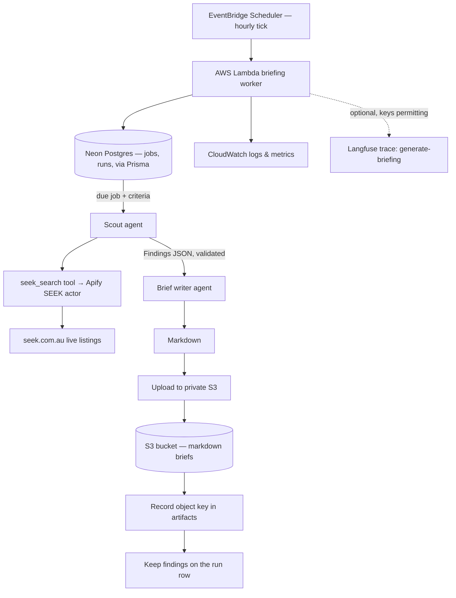
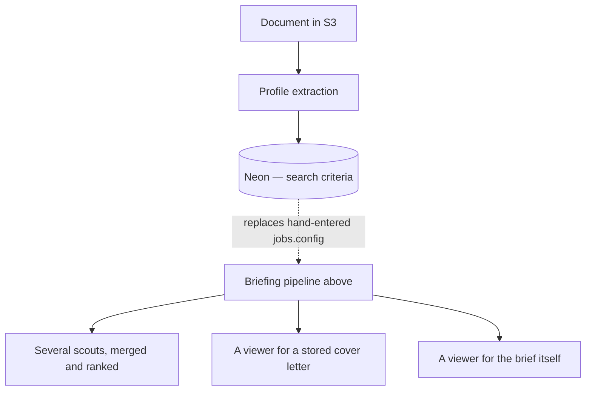

# Job-search briefing pipeline

A scheduled worker turns a candidate's search criteria into a private, per-user
job-search brief.

Each run: read the criteria → query SEEK's live listings for matching postings →
validate the findings → compose markdown → upload to private S3 → record the
object key and the findings in Neon.

Vocabulary is in `CONTEXT.md`, and it is worth reading first — in particular
**Job** means "a row in `jobs`, a thing that runs on a cadence" and never an
employment opportunity, which is a **Posting**. To a user a job is a
**Briefing**, and what one run of it produces is a **Brief**.

## Where it lives

| Stage                                        | Owner                                                                                                                                    |
| -------------------------------------------- | ---------------------------------------------------------------------------------------------------------------------------------------- |
| Dashboard — chat, documents, briefings       | `apps/dashboard/` (Next.js 16 App Router, Vercel)                                                                                        |
| Lambda entrypoint + hourly tick              | `apps/briefing-worker/src/` (`index.ts`, `run-tick.ts`)                                                                                  |
| One briefing run                             | `apps/briefing-worker/src/run-briefing.ts`                                                                                               |
| What `jobs.config` means                     | `apps/briefing-worker/src/job-search-config.ts`                                                                                          |
| Scout and brief-writer agents                | `packages/agents/src/` — one `createX()` factory per module                                                                              |
| The scout↔writer contract                    | `packages/agents/src/findings.ts`                                                                                                        |
| The tool catalog                             | `packages/agent-tools/src/` — one tool per module                                                                                        |
| Orchestrator graph, state, model             | `packages/agents-core/src/`                                                                                                              |
| Jobs, runs, artifacts                        | `packages/db/src/` (Prisma Client + domain helpers) and `packages/db/prisma/`                                                            |
| S3 read/write                                | `packages/user-storage/src/` — extend `brief-store.ts` / `resume-store.ts` / `cover-letter-store.ts`, never import the AWS SDK elsewhere |
| Langfuse tracing                             | `packages/langfuse/src/`, wired in each runtime's entry point                                                                            |
| EventBridge schedule, bucket, IAM, lifecycle | `infra/aws/` (`briefing-worker.tf`, `user-storage.tf`, `vercel-dashboard.tf`)                                                            |

**The tool catalog is three modules and there is no fetch tool.**
`seek-search.ts` queries SEEK's live inventory through an Apify actor,
`web-search.ts` is a general Tavily search, and `time.ts` answers what the
current time is. Nothing retrieves an arbitrary URL, and nothing should acquire
that ability casually — a fetcher is a security surface (SSRF, redirect chains,
response size, prompt injection from a page the model then acts on). The scout
carries `seek_search` alone; the dashboard's assistant carries `allTools`, which
is `get_current_time` and `web_search` — `seekSearch` is deliberately not in it.

## Rules

- **S3 stays private.** Neon stores object keys only — never URLs, never blob
  content. The `artifacts.object_key` CHECK enforces it.
- **Runs are idempotent.** `briefId` is the run id and the key partitions on the
  occurrence, so re-executing a run overwrites one object rather than making a
  second. Claiming is at-most-once; every duplicate occurrence is a paid run.
- **The scout returns data, not side effects.** No writes, no uploads, no DB
  calls inside it. It carries one tool, so this is structural.
- **URLs are copied, never composed.** Every posting must carry a URL a search
  actually returned; the findings schema rejects anything that is not a URL, and
  the worker rejects any URL that does not appear verbatim in a search result.
- **A run with no successful search fails.** Well-formed findings that never
  touched a live search would produce a confident brief citing postings nobody
  looked up — worse than no brief.
- **New `kinds.ts` entries need a matching `object_kinds` entry in Terraform**,
  or the objects get no retention and writes 403 for want of the per-kind grant.
- **Tracing is opt-in and never load-bearing.** `@workspace/langfuse` is a no-op
  without keys, and the worker's own trace sink emits nothing when no sink is
  passed. A run must behave identically either way.

## Flow

## Not built yet

The pipeline above runs end to end. These are the parts of the intended product
that do not exist, and none of them is implied by the code today:

- **Profile extraction.** Upload exists — `/documents` writes to the `resumes`
  object kind through a Server Action, and lists, downloads and deletes what is
  there. One thing now _reads_ a stored document —
  `apps/dashboard/lib/cover-letters/candidate-background.ts` fetches the newest
  document labelled `resume` and turns it into text for the **Letter Writer**,
  through `profile-text.ts` (#86) — `.md`, `.txt`, PDF via `unpdf` and DOCX via
  `mammoth`. `.doc`, `.odt` and `.rtf` still upload and still have no parser,
  and are refused by name. That is getting the _text_ out; what is still the gap
  is extraction proper — turning that text into search criteria. No Postgres row
  points at an upload either — `artifacts.run_id` is `NOT NULL` and references
  `runs`, so there is no row shape for one. Search criteria are still typed in
  by hand, now through the settings form rather than into the column directly.
  Extraction would most naturally be a `createX()` factory in
  `packages/agents/src/`, reading through `ResumeStore`.
- **Fan-out across several scouts, with merge and rank.** One scout runs today.
  Fanning out replaces what produces `Findings` and leaves everything downstream
  of it alone.
- **Reading a cover letter back.** Drafting one is built (#84): a Draft button
  on each **Posting** on `/briefings` runs the **Letter Writer** and stores the
  result at `prod/{userId}/cover-letters/{postingId}.md`, keyed on the Posting
  so a redraft overwrites one object. The letter is written from the newest
  **Document** labelled `resume`, and since #86 that can be a PDF or a DOCX as
  well as `.md` or `.txt`. What is still missing is everything around it —
  nothing lists or renders a stored letter, and nothing can edit one in the app.
  Ticketed under #77; `docs/cover-letter-agent-plan.md` is the staged plan.
- **A viewer for the brief itself.** `/briefings` shows what a run _found_: the
  **Postings** from each briefing's most recent successful **Run**, read out of
  the `runs.findings` record by `apps/dashboard/lib/briefings/latest-postings.ts`
  (#83). What is still missing is the **Brief** — the markdown that run wrote —
  and that gap is structural rather than merely unbuilt: the dashboard's IAM
  grants are `prod:resumes` and `prod:cover-letters`, and a brief lives under
  `prod:briefs`, so the app cannot read one without an infrastructure change.
  Widening the grant for cover letters (#84) deliberately did not widen it here
  — `tests/vercel_dashboard.tftest.hcl` asserts the exact key set, and that the
  dashboard's and the worker's grants stay disjoint. Nothing lists **Runs**
  either, and `latestArtifactForJob()` still has no caller outside its own tests
  — the briefings page deliberately does not use it, because it orders on run
  start _and_ artifact creation and stops being well defined once a run writes
  more than one artifact.

## Infrastructure

- Frontend and application on Vercel; database is Neon Postgres, reached through
  Prisma Client over a `pg` driver adapter.
- The scheduled worker runs on AWS Lambda, triggered hourly by EventBridge
  Scheduler. The tick is the same for every job, so a job's own cadence is a row
  in Postgres rather than anything in Terraform.
- S3 privately stores generated markdown briefs, uploaded documents and drafted
  cover letters. IAM is least-privilege and bounded by a permissions boundary;
  grants are per environment and kind, so the worker holds `prod:briefs` and the
  dashboard's Vercel OIDC role holds `prod:resumes` and `prod:cover-letters`,
  and the two roles' grants are disjoint — the dashboard cannot forge or delete
  a briefing.
- Secrets are AWS Secrets Manager shells whose values are set by hand —
  Terraform provisions containers it can never read.
- All AWS infrastructure is Terraform under `infra/aws/`, which Turborepo does
  not cover. CloudWatch provides logs, metrics and failure alarms.
- Langfuse receives one trace per agent run when its keys are present:
  `generate-briefing` from the worker, `chat-response` and `cover-letter` from
  the dashboard. All retain full prompts, tool I/O and outputs by design.

## Design requirements

- Keep searching, composition, storage, database and scheduling concerns
  separated, with typed interfaces between them.
- Make individual scouts replaceable without changing the rest of the pipeline.
- Keep AWS-specific code behind adapters. Exactly two non-test files import the
  S3 SDK — `packages/user-storage/src/s3-user-object-store.ts`, and
  `apps/dashboard/lib/storage.ts`, which exists only to attach Vercel's OIDC
  credential provider through the store's `client` seam. The package deliberately
  accepts no credentials. In the worker, `index.ts` is the only file that knows
  it runs on Lambda.
- Preserve source URLs for traceability.
- Never make the bucket or the briefs public, and never store a public URL as the
  file reference; the object key is the persistent reference.
- Design for local development and automated testing: `runBriefing` takes its
  agents, its artifact write and its trace sink through injectable seams, so a
  run can be exercised without an API key, a database or AWS credentials.
