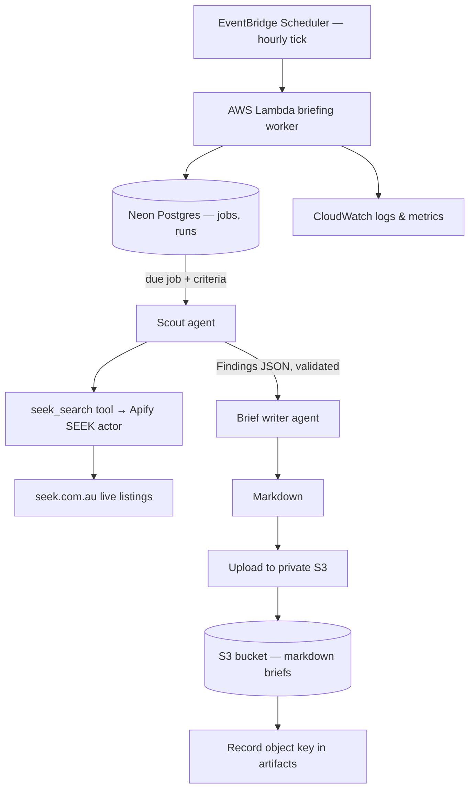
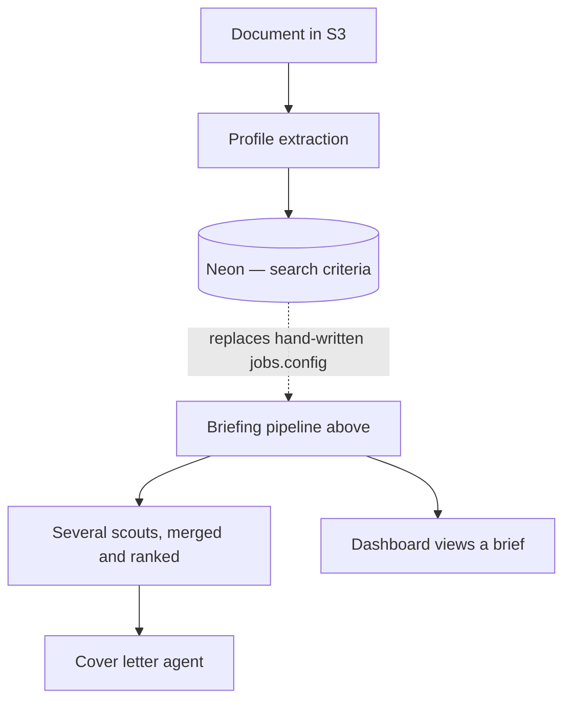

# Job-search briefing pipeline

A scheduled worker turns a candidate's search criteria into a private, per-user
job-search brief.

Each run: read the criteria → query SEEK's live listings for matching postings
→ validate the findings → compose markdown → upload to private S3 → record the
object key in Neon.

Vocabulary is in `CONTEXT.md`, and it is worth reading first — in particular
**Job** means "a row in `jobs`, a thing that runs on a cadence" and never an
employment opportunity, which is a **Posting**.

## Where it lives

| Stage                                        | Owner                                                                                                          |
| -------------------------------------------- | -------------------------------------------------------------------------------------------------------------- |
| Dashboard, brief viewing                     | `apps/dashboard/` (Next.js 16 App Router, Vercel)                                                              |
| Lambda entrypoint + hourly tick              | `apps/briefing-worker/src/` (`index.ts`, `run-tick.ts`)                                                        |
| One briefing run                             | `apps/briefing-worker/src/run-briefing.ts`                                                                     |
| What `jobs.config` means                     | `apps/briefing-worker/src/job-search-config.ts`                                                                |
| Scout and brief-writer agents                | `packages/agents/src/` — one `createX()` factory per module                                                    |
| The scout↔writer contract                    | `packages/agents/src/findings.ts`                                                                              |
| Search and fetch tools                       | `packages/agent-tools/src/` — one tool per module                                                              |
| Orchestrator graph, state, model             | `packages/agents-core/src/`                                                                                    |
| Jobs, runs, artifacts SQL                    | `packages/db/src/` + `packages/db/migrations/`                                                                 |
| S3 read/write                                | `packages/user-storage/src/` — extend `brief-store.ts` / `resume-store.ts`, never import the AWS SDK elsewhere |
| EventBridge schedule, bucket, IAM, lifecycle | `infra/aws/` (`briefing-worker.tf`, `user-storage.tf`)                                                         |

## Rules

- **S3 stays private.** Neon stores object keys only — never URLs, never blob
  content. The `artifacts.object_key` CHECK enforces it.
- **Runs are idempotent.** `briefId` is the run id and the key partitions on the
  occurrence, so re-executing a run overwrites one object rather than making a
  second. Claiming is at-most-once; every duplicate occurrence is a paid run.
- **The scout returns data, not side effects.** No writes, no uploads, no DB
  calls inside it. It carries one tool, so this is structural.
- **URLs are copied, never composed.** Every posting must carry a URL a search
  actually returned; the findings schema rejects anything that is not a URL,
  and the worker rejects any URL that does not appear verbatim in a search
  result.
- **A run with no successful search fails.** Well-formed findings that never
  touched a live search would produce a confident brief citing postings nobody
  looked up — worse than no brief.
- **New `kinds.ts` entries need a matching `object_kinds` entry in Terraform**,
  or the objects get no retention and writes 403 for want of the per-kind grant.

## Flow

## Not built yet

The pipeline above runs end to end. These are the parts of the intended product
that do not exist, and none of them is implied by the code today:

- **Profile extraction.** Upload now exists — `/documents` in the dashboard
  writes to the `resumes` object kind through a Server Action, and lists,
  downloads and deletes what is there. What does not exist is anything that
  _reads_ a stored document: no Postgres row points at one, and search criteria
  are still hand-written into `jobs.config`. Extraction would most naturally be
  a `createX()` factory in `packages/agents/src/`, reading through
  `ResumeStore`. Note that S3 is the only record of an upload — `artifacts` has
  no row shape for one, because `artifacts.run_id` is `NOT NULL` and references
  `runs`.
- **Fan-out across several scouts, with merge and rank.** One scout runs today.
  Fanning out replaces what produces `Findings` and leaves everything downstream
  of it alone.
- **Cover letters.**
- **Any dashboard UI for briefs.** `apps/dashboard` has an assistant chat, the
  documents section, a settings page and the auth pages. Settings now manages
  **jobs** — create a briefing, turn it on or off, change its cadence, through
  `JobStore.listForUser()`, `create()`, `pause()`, `resume()` and
  `updateSchedule()`. What is still missing is anything that surfaces a
  **brief**: `ArtifactStore.latestForJob()` exists and has no caller, so a run's
  output is reachable only from S3.

## Infrastructure

- Frontend and application on Vercel; database is Neon Postgres.
- The scheduled worker runs on AWS Lambda, triggered hourly by EventBridge
  Scheduler. The tick is the same for every job, so a job's own cadence is a row
  in Postgres rather than anything in Terraform.
- S3 privately stores generated markdown briefs. IAM is least-privilege and
  bounded by a permissions boundary; the worker holds the `prod:briefs` grant
  and nothing wider.
- Secrets are AWS Secrets Manager shells whose values are set by hand —
  Terraform provisions containers it can never read.
- All AWS infrastructure is Terraform under `infra/aws/`, which Turborepo does
  not cover. CloudWatch provides logs, metrics and failure alarms.

## Design requirements

- Keep searching, composition, storage, database and scheduling concerns
  separated, with typed interfaces between them.
- Make individual scouts replaceable without changing the rest of the pipeline.
- Keep AWS-specific code behind storage adapters — `s3-user-object-store.ts` is
  the only file importing the AWS S3 SDK, and `index.ts` the only worker file
  that knows it runs on Lambda.
- Preserve source URLs for traceability.
- Never make the bucket or the briefs public, and never store a public URL as
  the file reference; the object key is the persistent reference.
- Design for local development and automated testing: `runBriefing` takes its
  agents through injectable seams so a run can be exercised without an API key.
