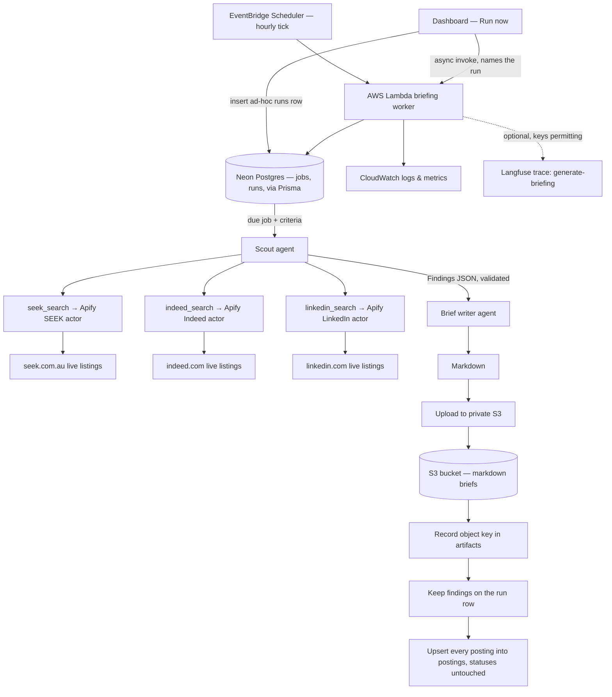
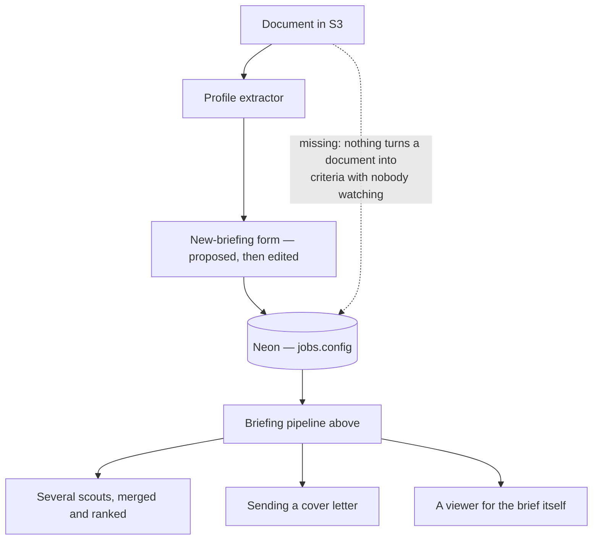

# Job-search briefing pipeline

A scheduled worker turns a candidate's search criteria into a private, per-user
job-search brief.

Each run: read the criteria → query each job board's live listings for matching
postings → validate the findings → compose markdown → upload to private S3 →
record the object key and the findings in Neon → add every posting found to the
cumulative `postings` record.

Vocabulary is in `CONTEXT.md`, and it is worth reading first — in particular
**Job** means "a row in `jobs`, a thing that runs on a cadence" and never an
employment opportunity, which is a **Posting**. To a user a job is a
**Briefing**, and what one run of it produces is a **Brief**.

## Where it lives

| Stage                                        | Owner                                                                                                                                    |
| -------------------------------------------- | ---------------------------------------------------------------------------------------------------------------------------------------- |
| Dashboard — chat, documents, briefings       | `apps/dashboard/` (Next.js 16 App Router, Vercel)                                                                                        |
| Lambda entrypoint + hourly tick              | `apps/briefing-worker/src/` (`index.ts`, `run-tick.ts`)                                                                                  |
| A run someone triggered from the UI          | `apps/briefing-worker/src/run-ad-hoc.ts`, asked for by `apps/dashboard/lib/briefing-runs/`                                               |
| One briefing run                             | `apps/briefing-worker/src/run-briefing.ts`                                                                                               |
| What `jobs.config` means                     | `apps/briefing-worker/src/job-search-config.ts`                                                                                          |
| The named agents                             | `packages/agents/src/` — one `createX()` factory per module                                                                              |
| The scout↔writer contract                    | `packages/agents/src/findings.ts`                                                                                                        |
| The search-criteria contract                 | `packages/agents/src/criteria.ts`                                                                                                        |
| Proposing criteria from a resume             | `apps/dashboard/lib/jobs/suggest-criteria-actions.ts`, reading through `apps/dashboard/lib/cover-letters/candidate-background.ts`        |
| The tool catalog                             | `packages/agent-tools/src/` — one tool per module                                                                                        |
| Orchestrator graph, state, model             | `packages/agents-core/src/`                                                                                                              |
| Jobs, runs, artifacts                        | `packages/db/src/` (Prisma Client + domain helpers) and `packages/db/prisma/`                                                            |
| Every Posting ever found, and its status     | `packages/db/src/postings.ts`, projected from findings by `apps/briefing-worker/src/postings.ts`, read by `apps/dashboard/lib/postings/` |
| S3 read/write                                | `packages/user-storage/src/` — extend `brief-store.ts` / `resume-store.ts` / `cover-letter-store.ts`, never import the AWS SDK elsewhere |
| Langfuse tracing                             | `packages/langfuse/src/`, wired in each runtime's entry point                                                                            |
| EventBridge schedule, bucket, IAM, lifecycle | `infra/aws/` (`briefing-worker.tf`, `user-storage.tf`, `vercel-dashboard.tf`)                                                            |

**The tool catalog is five tools and there is no fetch tool.**
`seek-search.ts`, `indeed-search.ts` and `linkedin-search.ts` each query one job
board's live inventory through its own Apify actor, over the shared runner in
`apify-search.ts` — which is machinery rather than a tool, and is what makes a
board an actor id, a request body and a field mapping instead of a fourth
implementation. `web-search.ts` is a general Tavily search, and `time.ts`
answers what the current time is. Nothing retrieves an arbitrary URL, and
nothing should acquire that ability casually — a fetcher is a security surface
(SSRF, redirect chains, response size, prompt injection from a page the model
then acts on). The scout carries the three board tools and nothing else; the
dashboard's assistant carries `allTools`, which is `get_current_time` and
`web_search` — the board tools are deliberately not in it.

## Rules

- **S3 stays private.** Neon stores object keys only — never URLs, never blob
  content. The `artifacts.object_key` CHECK enforces it.
- **Runs are idempotent.** `briefId` is the run id and the key partitions on the
  occurrence, so re-executing a run overwrites one object rather than making a
  second. Claiming is at-most-once; every duplicate occurrence is a paid run.
- **Two ways in, one pipeline, two claims.** The hourly tick claims a _slot_
  (`claimJob`, guarded by the partial unique index on
  `(job_id, scheduled_for)`); a run someone triggers claims the _row_
  (`claimAdHocRun`, guarded by `runs.claimed_at`). Both are at-most-once and
  neither is optional — the trigger is an asynchronous Lambda invocation, which
  AWS delivers at least once. A triggered run takes no slot and leaves
  `next_run_at` alone.
- **A failed tick throws; a failed triggered run does not.** The tick's throw is
  what produces the `Errors` datapoint its alarm watches, and that alarm is
  daily and latching. A run a person started reports itself on its `runs` row
  and in the UI, so routing it into the alarm as well would spend the only
  signal that says _the schedule is broken_.
- **The scout returns data, not side effects.** No writes, no uploads, no DB
  calls inside it. It carries one tool, so this is structural.
- **URLs are copied, never composed.** Every posting must carry a URL a search
  actually returned; the findings schema rejects anything that is not a URL, and
  the worker separately drops any posting no search returned. "Returned" is
  measured by `postingId()` rather than byte-for-byte, because a board's
  per-search tracking parameters are not part of a posting's identity — see
  `apps/briefing-worker/src/posting-urls.ts`.
- **A dropped posting costs the posting, not the Run.** The brief is written
  from what survived, and the Run succeeds carrying a `postingUrls` warning that
  names what was left out. A Run where _every_ reported posting is unaccounted
  for still fails: that is a scout that has stopped copying URLs at all.
- **A run with no successful search fails.** Well-formed findings that never
  touched a live search would produce a confident brief citing postings nobody
  looked up — worse than no brief.
- **A run never overwrites a Posting's status.** `recordPostings` upserts on
  `(user_id, posting_id)` and its `DO UPDATE SET` list omits `status` — the only
  column in the schema a person writes. That omission is the tracker; see
  `packages/db/README.md` §Schema notes.
- **New `kinds.ts` entries need a matching `object_kinds` entry in Terraform**,
  or the objects get no retention and writes 403 for want of the per-kind grant.
- **Tracing is opt-in and never load-bearing.** `@workspace/langfuse` is a no-op
  without keys, and the worker's own trace sink emits nothing when no sink is
  passed. A run must behave identically either way.

## Flow

## Not built yet

The pipeline above runs end to end. These are the parts of the intended product
it still lacks. Most began as whole gaps and have since been partly closed —
each entry below leads with what is _missing_, so **a solid edge is a path that
exists and a dotted one is still the gap**:

- **Nothing turns a document into criteria with nobody watching.** Extraction
  itself is built: the **Profile Extractor**
  (`packages/agents/src/profile-extractor.ts`) reads the newest **Document**
  labelled `resume` and _proposes_ **Search Criteria**, validated on shape by
  `SearchCriteriaSchema` (`packages/agents/src/criteria.ts`), behind **Suggest
  from my resume** on the new-briefing form
  (`apps/dashboard/lib/jobs/suggest-criteria-actions.ts`). It reads through
  `loadCandidateBackground()` rather than adding a document picker, deliberately
  — "which document is my resume" has to mean one thing across the app, or a
  **Cover Letter** and a **Briefing** end up drawn from different files with
  nothing saying so.

  What is missing is anything that closes the loop without a person in it. The
  extractor proposes into the form's fields, the user edits them, and
  `jobs.config` is written by the ordinary create action on Create. The
  suggestion persists nothing — which is why the action calls no `refresh()`,
  having invalidated nothing — and no Postgres row points at an upload:
  `artifacts.run_id` is `NOT NULL` and references `runs`, so nothing records
  which Document a briefing's criteria came out of. `.doc`, `.odt` and `.rtf`
  also still upload with no parser and are refused by name; `.md`, `.txt`, PDF
  and DOCX are read by `profile-text.ts` (#86).

- **Fan-out across several scouts, with merge and rank.** One scout runs today.
  Fanning out replaces what produces `Findings` and leaves everything downstream
  of it alone.
- **Sending a cover letter.** Everything short of delivery is built, under #77.
  Drafting (#84): a Draft button on each **Posting** on `/briefings` runs the
  **Letter Writer** over the advertisement stored on that Posting's row —
  `postings.payload`, re-read server-side, since the page no longer holds a
  Run's findings to draft from — and stores the result at
  `prod/{userId}/cover-letters/{postingId}.md`, keyed on the Posting so a
  redraft overwrites one object. The letter's key and the row's identity are the
  same `postingId()` value, which is what keeps a stored letter attached to the
  Posting it was written for. Listing and downloading (#85):
  `cover-letter-rows.ts` pays one `HeadObject` per visible Posting, because a
  listing carries no user metadata, and `/api/cover-letters/{postingId}` hands
  the Markdown back as a file. **Letter Instructions** — a per-user row in
  `cover_letter_instructions`, edited from `/settings` and composed onto the
  writer's prompt by `coverLetterSystemPrompt()` — make tone and structure
  settable, with an optional example letter fenced as a style reference and
  never as a source of facts. Editing: **Edit letter** opens the stored Markdown
  as rich text in `FileEditorDialog` and **Save** writes it back over the same
  object, carrying `drafted-at` and provenance across because an edit is not a
  drafting. A save refuses when no letter exists at that address, which keeps an
  action that _does_ take letter text from a form out of the business of
  creating one. Delivery has no code at all.

- **A viewer for the Brief itself, and that gap is structural rather than
  merely unbuilt.** The dashboard's IAM grants are `prod:resumes` and
  `prod:cover-letters` while a brief lives under `prod:briefs`, so the app
  cannot read one without an infrastructure change. Widening the grant for cover
  letters (#84) deliberately did not widen it here —
  `tests/vercel_dashboard.tftest.hcl` asserts the exact key set, and that the
  dashboard's and the worker's grants stay disjoint.

  What `/briefings` does show is what the runs have _found_ — every **Posting**
  any of this user's briefings has ever turned up, read out of the `postings`
  table by `lib/postings/list-postings.ts` as a sorted, server-paginated table,
  each row carrying the **Posting Status** its owner set and opening its full
  detail in a dialog. It no longer reads one Run's `runs.findings`, so a Posting
  the next Run does not re-find stays on the page rather than vanishing
  overnight. Above the table, `components/briefings/briefing-strip.tsx` renders
  one line per briefing from `run-activity.ts` — its most recent Run whatever
  became of it, running, failed, or too long in `running` to still be believed —
  and carries that briefing's **Run now** button, which is what makes the line
  worth watching. That is a status line and not a history: nothing lists more
  than one Run per briefing and nothing can cancel one. There is no
  "latest artifact for this job" helper either — once a run can write more than
  one artifact, that query stops being well defined, and the briefings page
  never needed it: briefs live under `prod:briefs`, which the dashboard cannot
  read.

## Infrastructure

- Frontend and application on Vercel; database is Neon Postgres, reached through
  Prisma Client over a `pg` driver adapter.
- The scheduled worker runs on AWS Lambda, triggered hourly by EventBridge
  Scheduler. The tick is the same for every job, so a job's own cadence is a row
  in Postgres rather than anything in Terraform.
- S3 privately stores generated markdown briefs, uploaded documents and drafted
  cover letters. IAM is least-privilege and bounded by a permissions boundary;
  grants are per environment and kind, so the worker holds `prod:briefs` and the
  dashboard's Vercel OIDC role holds `prod:resumes` and `prod:cover-letters`,
  and the two roles' grants are disjoint — the dashboard cannot forge or delete
  a briefing.
- Secrets are AWS Secrets Manager shells whose values are set by hand —
  Terraform provisions containers it can never read.
- All AWS infrastructure is Terraform under `infra/aws/`, which Turborepo does
  not cover. CloudWatch provides logs, metrics and failure alarms.
- Langfuse receives one trace per agent run when its keys are present:
  `generate-briefing` from the worker, and `chat-response`, `cover-letter` and
  `search-criteria` from the dashboard. All retain full prompts, tool I/O and
  outputs by design — which for the last two means the candidate's CV, so the
  keys are what decides whether it leaves the machine.

## Design requirements

- Keep searching, composition, storage, database and scheduling concerns
  separated, with typed interfaces between them.
- Make individual scouts replaceable without changing the rest of the pipeline.
- Keep AWS-specific code behind adapters. Exactly two non-test files import the
  S3 SDK — `packages/user-storage/src/s3-user-object-store.ts`, and
  `apps/dashboard/lib/storage.ts`, which exists only to attach Vercel's OIDC
  credential provider through the store's `client` seam. The package deliberately
  accepts no credentials. One further file imports the **Lambda** SDK —
  `apps/dashboard/lib/briefing-runs/invoke-worker.ts` — for the same reason and
  behind the same kind of seam: it exposes a `BriefingInvoker` interface, so the
  action that triggers a run never sees a client. In the worker, `index.ts` is
  the only file that knows it runs on Lambda, and it is where the invocation
  payload is read.
- Preserve source URLs for traceability.
- Never make the bucket or the briefs public, and never store a public URL as the
  file reference; the object key is the persistent reference.
- Design for local development and automated testing: `runBriefing` takes its
  agents, its artifact write and its trace sink through injectable seams, so a
  run can be exercised without an API key, a database or AWS credentials.
