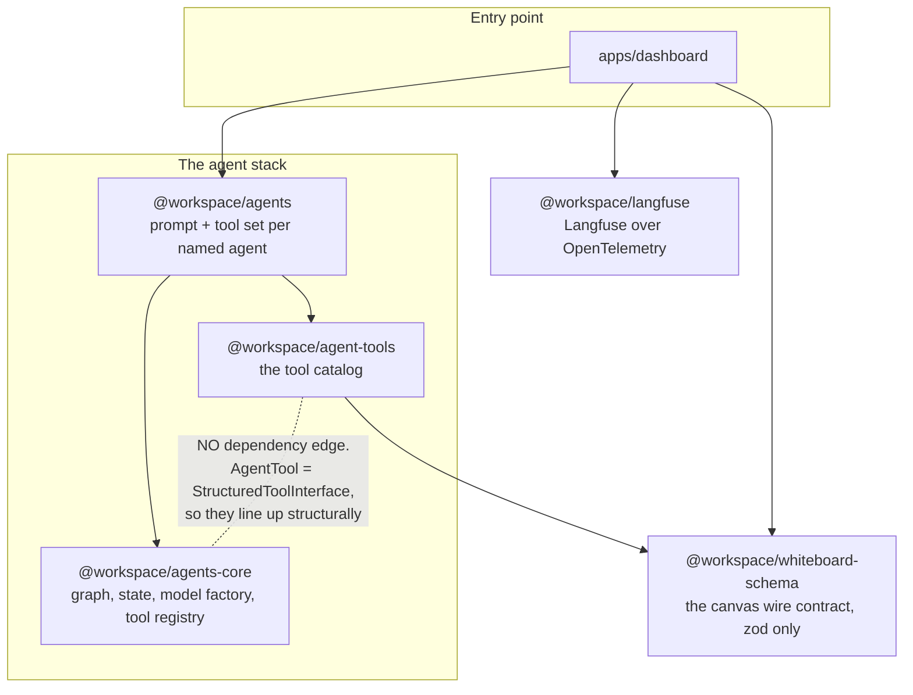
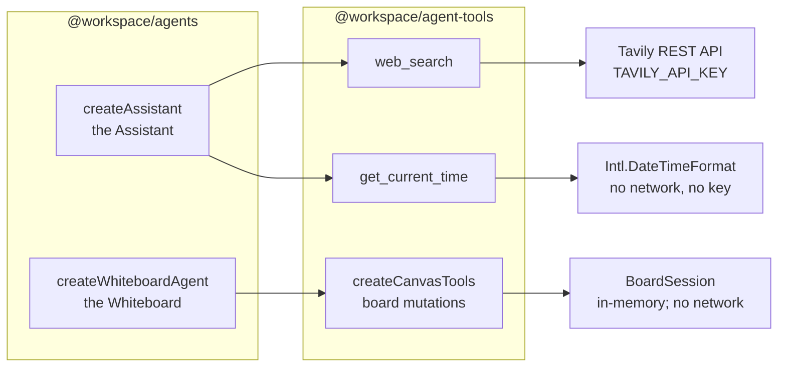
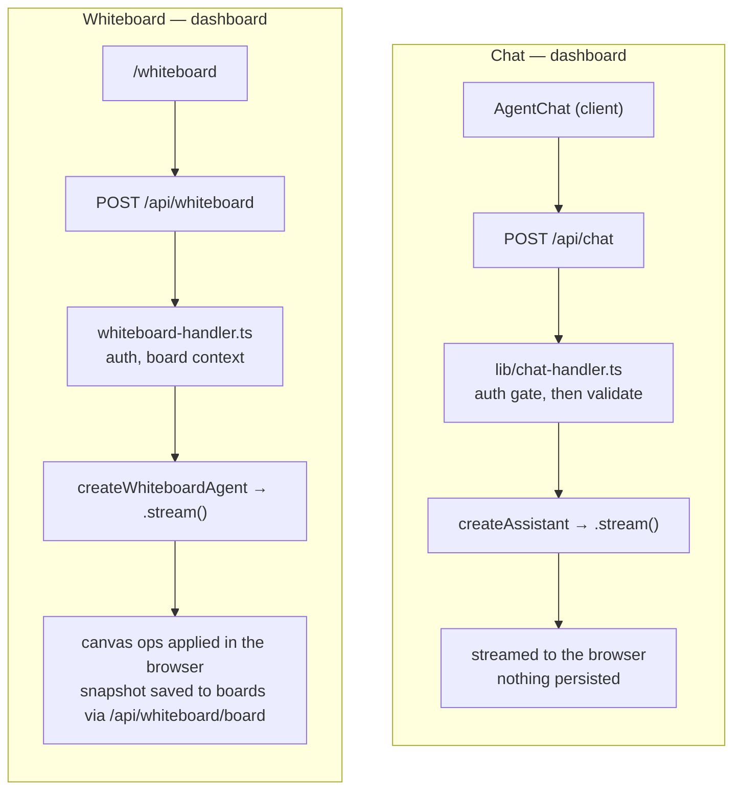
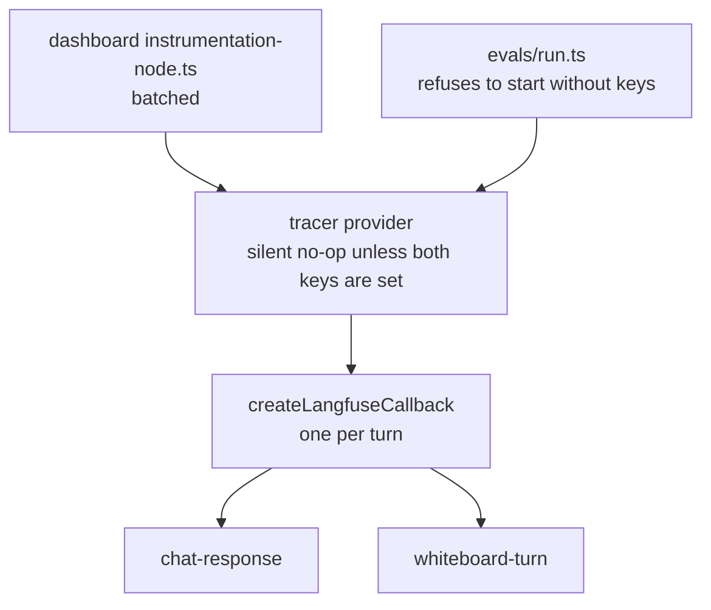

# Agent architecture

How the agent stack fits together: which packages depend on which, what the
runtime graph does, which agent carries which tools, who invokes them, and how a
turn is traced.

`OVERVIEW.md` maps the product and where each part lives. This is the view
underneath that — the packages, the graph, and the tool catalog.

Vocabulary follows `CONTEXT.md`.

---

## 1. Package layering

Three layers, plus tracing and the whiteboard wire contract off to one side. The
direction of the arrows is the design, and so is one arrow that is deliberately
missing.

What this picture is making explicit:

- **`agent-tools` does not depend on `agents-core`.** Tools are plain LangChain
  tools, and `AgentTool` in the runtime is a type alias for the same
  `StructuredToolInterface`. The two fit structurally, not by dependency, so the
  catalog works with any caller and the runtime ships no tools at all
  (`createAgent({ tools })` defaults to none).
- **The dashboard imports `@workspace/agents`, `@workspace/langfuse` and
  `@workspace/whiteboard-schema`, and nothing else from this picture.**
  `agents-core` and `agent-tools` reach it through `@workspace/agents`.
- **`@workspace/langfuse` has no edge to the stack in either direction.** It is a
  composition-root concern, which is why `@langfuse/*` and `@opentelemetry/*`
  stay out of the runtime entirely.
- **`@workspace/whiteboard-schema` is below the stack rather than in it**, and
  is the one package a browser bundle imports directly. Both ends of the canvas
  wire need it — the tools and the dashboard's client components — so it depends
  on zod and nothing else, and anything added to it is added to a browser
  bundle. It was `canvas-schema.ts` inside `agent-tools` until that meant the
  dashboard's client bundle waiting on the tool catalog's build for a type.

`agents` exposes wildcard `./*` subpaths. `agent-tools` exposes one directory
pattern and three root modules — `whiteboard/*`, `./time`, `./web-search`,
`./env` — and deliberately nothing else, so `internal/` stays private and has no
consumers to break. `agents-core`, `langfuse` and `whiteboard-schema` expose
`"."` alone, which is why every consumer imports those three from the root.

**There is no `@workspace/agent-tools` root export at all.** It held `allTools`,
which claimed to be "every tool in the catalog" while holding two, for the
structural reason that the canvas tools are a factory bound to one whiteboard
turn and a module-level array cannot hold them. Removing the barrel rather than
correcting it means the claim cannot come back.

---

## 2. The runtime graph

`createAgent` in `packages/agents-core/src/agent.ts` builds and compiles one
LangGraph. This is it, node for node.

State is two fields (`state.ts`): `messages`, using the prebuilt message-aware
reducer so a node returns only what it produced, and `llmCalls`, which
accumulates via a summing reducer purely so the router can stop a runaway loop.

**The tool node runs calls in parallel.** Models emit several tool calls at once;
all are dispatched concurrently and returned in one update, so every `tool_use`
gets its matching `tool_result`.

**`halt` is the interesting node.** When the budget is gone the run is diverted
there rather than simply ending, because ending would leave the last tool calls
unanswered — and an unanswered tool call is rejected on the next turn. `halt`
answers each one with a `status:"error"` ToolMessage saying the budget ran out,
so the transcript stays well-formed.

| Budget                     | Value | Why                                                                                                   |
| -------------------------- | ----- | ----------------------------------------------------------------------------------------------------- |
| `DEFAULT_MAX_LLM_CALLS`    | 5     | Sized for a question with one tool round trip                                                         |
| `WHITEBOARD_MAX_LLM_CALLS` | 24    | A system architecture is six to ten shapes and as many arrows, and every tool round trip costs a call |

**A budget is only reachable because the graph sets its own `recursionLimit`.**
`model` and `tools` are one LangGraph super-step each, so `n` model calls cost
`2n` steps and the runtime's default of 25 caps every budget at 12 — the run
throws `GraphRecursionError` part-way through rather than reaching `halt`.
`createAgent` binds `recursionLimitFor(maxLlmCalls)` (`2n + 1`) to the compiled
graph so no call site has to know. The Whiteboard's 24 depends on it.

The tool registry (`tools.ts`) is the other containment point. Duplicate tool
names **throw at construction** rather than silently shadowing each other. After
that nothing a tool does can break the run: an unknown tool name and a tool that
throws both come back as `status:"error"` ToolMessages.

The model is a `ChatOpenAI` on `gpt-5.4-mini` (`model.ts`), except for the
whiteboard agent, which asks for `gpt-5.4` (`WHITEBOARD_MODEL`) because it has to
hold a spatial model of the board across a dozen tool calls. `temperature` is
deliberately never set — reasoning-capable models reject any non-default value.

---

## 3. Agents and their tools

Two agents. What separates them is which tools they carry, and **tool scope here
is a containment boundary rather than a tuning knob.**

| Agent                   | Tools                                     | Why that set                                                                                                                                                                                                                                          |
| ----------------------- | ----------------------------------------- | ----------------------------------------------------------------------------------------------------------------------------------------------------------------------------------------------------------------------------------------------------- |
| `createAssistant`       | `ASSISTANT_TOOLS` + `extraTools`          | The one general-purpose agent. Its set is two module singletons — `get_current_time`, `web_search` — named in `assistant.ts` and pinned by `assistant.test.ts`, because widening it widens what a chat agent can do for anyone who can reach the chat |
| `createWhiteboardAgent` | `createCanvasTools(board)` + `extraTools` | Nine verbs over one in-memory board session for the turn; no search, no fetch, no S3. The session helpers come from `@workspace/agent-tools/whiteboard/`, and the schema both ends agree on from `@workspace/whiteboard-schema`                       |

### Why the whiteboard agent does not compute coordinates

`draw_diagram` is the largest of the nine tools and the one the prompt steers
everything past two boxes toward. It takes nodes and arrows and **no positions
at all**; `packages/agent-tools/src/whiteboard/graph-layout.ts` ranks them by those arrows
— cycle break, longest-path layering, barycentre ordering, then a separation
pass — and returns a position per node.

Two things follow, and both were previously impossible:

- **Overlap is a property of the algorithm rather than of the model's luck.**
  The model cannot see the canvas, so a box it puts on top of another stays
  there; `create_shape` now at least says so in its reply, but the real fix is
  not asking it for the coordinate. `arrange_shapes` gained `flow-right` and
  `flow-down` for the same reason — they are the only layouts that read the
  board's existing arrows, which is what "clean this diagram up" needs.
- **A diagram costs one round trip instead of eighteen.** Six boxes and seven
  arrows used to be thirteen tool calls against a budget of 24. That is why
  `WHITEBOARD_MAX_LLM_CALLS` stayed at 24 rather than falling with it: drawing
  no longer spends the budget, editing does.

The board reaches the model **inside its system prompt**, via
`renderBoardContext`, which means every shape label the user has typed is
rendered into the most privileged part of the request. The prompt therefore
tells the model to treat that text as quoted material — a shape labelled like an
instruction is a shape with a strange label. A fence is a label, not a boundary,
which is why `packages/agents/evals/cases/injection.ts` exists to keep that
clause honest, and why the real containment is that the agent's only tools are
the nine canvas verbs.

### Two notes on the catalog

- **There is no catalog-wide tool list, and there deliberately is not one.**
  `allTools` used to be it: `[getCurrentTime, webSearch]`, calling itself "every
  tool in the catalog" while the canvas tools, a factory bound to one turn's
  board session, could never be in a module-level array. The barrel is gone.
  Each agent names its own set — `ASSISTANT_TOOLS` in `assistant.ts`,
  `createCanvasTools(board, { turnId })` in `whiteboard.ts` — so the Assistant
  cannot draw on the whiteboard, and nothing claims otherwise.
- **Agents are `createX()` factories, never instances.** Building one constructs
  a model, which reads `OPENAI_API_KEY` and throws without it. A module-level
  instance would move that failure to import time and break any consumer that
  merely imports the module. Every tool reads its key inside the call for the
  same reason, so importing the catalog is always free. The whiteboard agent is
  per-request for a second reason too: the board it reasons about is baked into
  its system prompt, so an instance would outlive its truth.

---

## 4. Who invokes what

Two entry points, both in the dashboard, and both streamed.

**Both stream**, because both agents have tools and the interesting part is
watching them work. The whiteboard adds a `custom` stream mode beside `values`
and `messages`, which is the channel canvas ops travel on — so shapes land while
the sentence describing them is still arriving.

The dashboard imports each agent by wildcard subpath —
`@workspace/agents/assistant` and `@workspace/agents/whiteboard` — and each
handler takes the factory as a `*Deps` seam under its exported name (`NAMING.md`
R2), so a test hands it a fake without a model or a key.

`packages/agents/evals/runner.ts` builds the same whiteboard agent outside the
dashboard, against the fixed cases in `evals/cases/` — see
`packages/agents/evals/README.md`.

---

## 5. Tracing

One mechanism, opt-in, and never load-bearing.

Langfuse is gated on `LANGFUSE_PUBLIC_KEY` and `LANGFUSE_SECRET_KEY`. Without
both, the adapter's functions are **silent no-ops rather than errors** —
`createLangfuseCallback` returns `undefined`, which is why call sites spread
`...(callback ? { callbacks: [callback] } : {})`.

The dashboard initialises the exporter `batched`, because a long-lived process
can afford to; `immediate` exists for a runtime that can be frozen the moment
its handler returns. Each trace is one agent answering one request, so neither
needs a root span wrapped around it.

**A `whiteboard-turn` trace carries every label on the user's board**, because
the board is rendered into the system prompt, and Langfuse retains full prompts
by design. Whether that text leaves the machine is decided entirely by whether
the two keys are set — which is the one place the no-op default is a privacy
property and not merely a convenience.

An eval is the exception to the no-op rule: it **refuses to start** without
keys, because its scores would have nowhere to go.

---

## Where things live

| Package                      | Holds                                                                                                                                                                                                              |
| ---------------------------- | ------------------------------------------------------------------------------------------------------------------------------------------------------------------------------------------------------------------ |
| `packages/agents`            | `assistant` and `whiteboard`, plus `agent-options` (the option shape both take). Also `evals/`, the scored whiteboard harness, which is outside `src/` and outside `pnpm test`                                     |
| `packages/agents-core`       | `agent.ts` (graph), `state.ts`, `model.ts`, `tools.ts` (registry), `env.ts`                                                                                                                                        |
| `packages/agent-tools`       | Grouped by domain, no barrel. `whiteboard/`: `canvas.ts` / `session.ts` / `layout.ts` / `render.ts` / `graph-layout.ts`. `internal/http.ts` is unexported; `time.ts`, `web-search.ts` and `env.ts` sit at the root |
| `packages/whiteboard-schema` | `index.ts` alone — the canvas wire contract, zod and nothing else, imported by the tools above and by the dashboard's client components                                                                            |
| `packages/langfuse`          | `initializeLangfuse`, `createLangfuseCallback` and `shutdownLangfuse`, used by the dashboard and the eval CLI; `runWithLangfuseTrace` is still exported and has no caller                                          |
