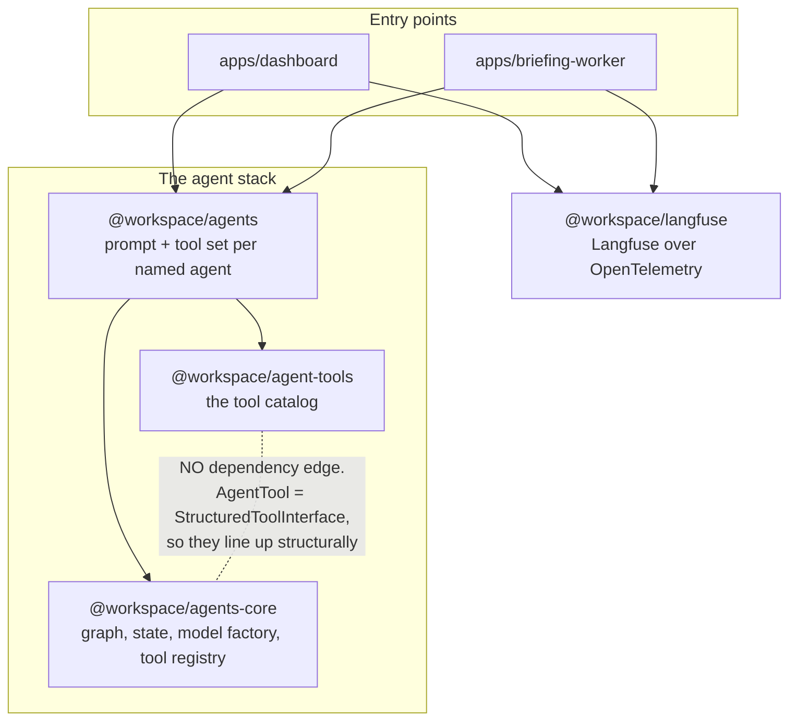
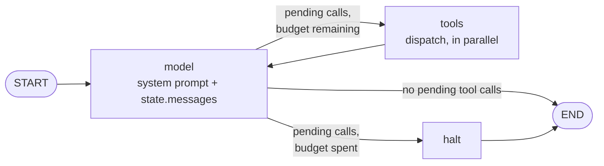
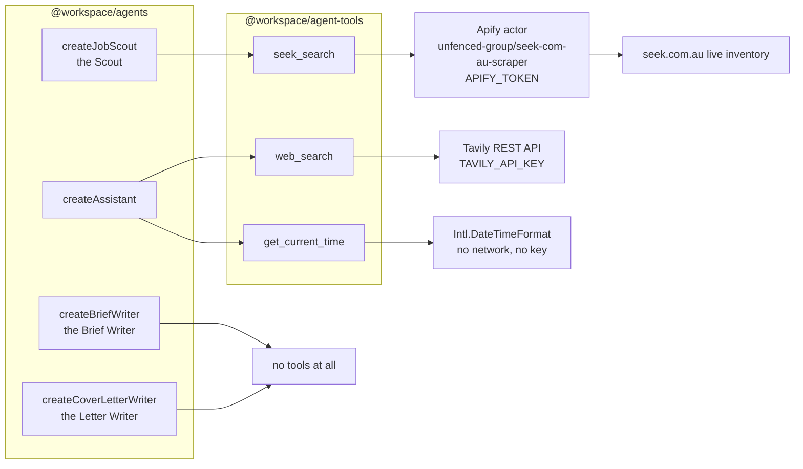
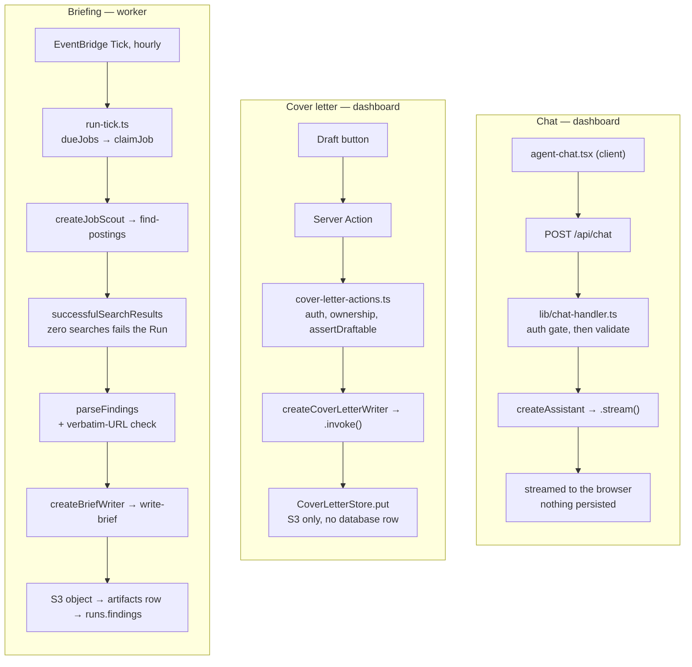
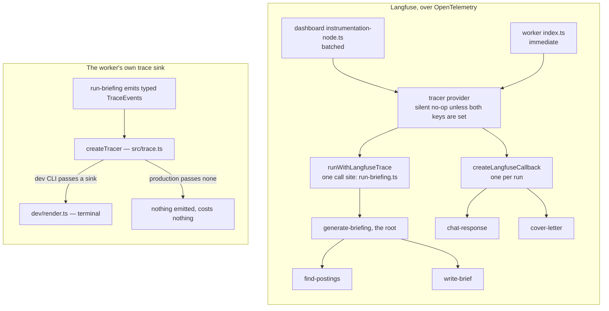

# Agent architecture

How the agent stack fits together: which packages depend on which, what the
runtime graph does, which agent carries which tools, who invokes them, and how a
run is traced.

`OVERVIEW.md` maps the product pipeline and shows the agents as two boxes. This
is the view underneath that — the packages, the graph, and the tool catalog.

Vocabulary follows `CONTEXT.md`. In particular a **Job** is a row in `jobs`, a
thing that runs on a cadence, and never an employment opportunity — that is a
**Posting**.

---

## 1. Package layering

Three layers, plus tracing off to one side. The direction of the arrows is the
design, and so is one arrow that is deliberately missing.

Three things this picture is making explicit:

- **`agent-tools` does not depend on `agents-core`.** Tools are plain LangChain
  tools, and `AgentTool` in the runtime is a type alias for the same
  `StructuredToolInterface`. The two fit structurally, not by dependency, so the
  catalog works with any caller and the runtime ships no tools at all
  (`createAgent({ tools })` defaults to none).
- **Neither app declares `agents-core` or `agent-tools`.** Both list only
  `@workspace/agents` and `@workspace/langfuse`; the lower layers arrive
  transitively. That is the layering holding.
- **`@workspace/langfuse` has no edge to the stack in either direction.** It is a
  composition-root concern, which is why `@langfuse/*` and `@opentelemetry/*`
  stay out of the runtime entirely.

Only `agents` and `agent-tools` expose wildcard `./*` subpaths. `agents-core`
and `langfuse` expose `"."` alone — which is why every consumer imports those two
from the root.

---

## 2. The runtime graph

`createAgent` in `packages/agents-core/src/agent.ts` builds and compiles one
LangGraph. This is it, node for node.

State is two fields (`state.ts`): `messages`, using the prebuilt message-aware
reducer so a node returns only what it produced, and `llmCalls`, which
accumulates via a summing reducer purely so the router can stop a runaway loop.

**The tool node runs calls in parallel.** Models emit several tool calls at once;
all are dispatched concurrently and returned in one update, so every `tool_use`
gets its matching `tool_result`.

**`halt` is the interesting node.** When the budget is gone the run is diverted
there rather than simply ending, because ending would leave the last tool calls
unanswered — and an unanswered tool call is rejected on the next turn. `halt`
answers each one with a `status:"error"` ToolMessage saying the budget ran out,
so the transcript stays well-formed.

| Budget                    | Value | Why                                                                                                                                                                                 |
| ------------------------- | ----- | ----------------------------------------------------------------------------------------------------------------------------------------------------------------------------------- |
| `DEFAULT_MAX_LLM_CALLS`   | 5     | Sized for a question with one tool round trip                                                                                                                                       |
| `JOB_SCOUT_MAX_LLM_CALLS` | 10    | A Scout makes several focused searches, one per role title and location; the default would divert it to `halt` mid-search and produce a partial answer that still looks well-formed |

The tool registry (`tools.ts`) is the other containment point. Duplicate tool
names **throw at construction** rather than silently shadowing each other. After
that nothing a tool does can break the run: an unknown tool name and a tool that
throws both come back as `status:"error"` ToolMessages.

The model is a `ChatOpenAI` on `gpt-5.4-mini` (`model.ts`). `temperature` is
deliberately never set — reasoning-capable models reject any non-default value.

---

## 3. Agents and their tools

Four agents. What separates them is mostly which tools they carry, and **tool
scope here is a containment boundary rather than a tuning knob.**

| Agent                     | Tools                     | Why that set                                                                                                                                                                               |
| ------------------------- | ------------------------- | ------------------------------------------------------------------------------------------------------------------------------------------------------------------------------------------ |
| `createJobScout`          | `[seekSearch]`            | Read-only **by construction**. With no tool that writes anything, "the Scout returns data and performs no side effects" is structural rather than a prompt rule someone can talk it out of |
| `createBriefWriter`       | `[]`                      | Cannot search, so it cannot quietly supplement thin Findings with something half-remembered; cannot write, so uploading stays with the worker                                              |
| `createCoverLetterWriter` | `[]`                      | Prompt-injection containment — see below                                                                                                                                                   |
| `createAssistant`         | `allTools` + `extraTools` | The one genuinely general-purpose agent                                                                                                                                                    |

### Why the Letter Writer has no tools

The strongest case in the stack, and worth stating plainly. That agent holds the
candidate's CV in its context, and the Posting sitting beside it is
attacker-influenced text — anyone who can pay to place an advertisement writes
it, and its highlights reach the prompt **verbatim** rather than laundered
through a paraphrase, so an instruction hidden in a bullet point survives intact.

An agent that can both read a CV and issue an outbound request can be induced to
put one inside the other. Having no tools is exactly what makes copying the
advertisement acceptable: injected text can shape the prose of a draft the user
then reads and edits, and can reach nothing else. The prompt also tells the model
to treat posting text as quoted material, but the containment is the empty tool
list, and it is asserted structurally in `cover-letter-writer.test.ts` rather
than left to a comment.

When a page fetcher eventually exists it belongs on a separate agent that never
sees the profile, handing this one validated data.

### The same idea one level down

`seek_search` narrows its own reach the same way. The Apify actor behind it
accepts webhook, Telegram and Slack notification fields; the tool never sends
them. Its Zod input schema is the Scout's entire reach — which is what keeps the
no-side-effects property structural at the tool layer too.

### Two notes on the catalog

- **`seek_search` is not in `allTools`.** `allTools` is
  `[getCurrentTime, webSearch]`, and it is reached only through the wildcard
  subpath `@workspace/agent-tools/seek-search` — which is how `job-scout.ts`
  imports it. So the assistant, which carries `allTools`, cannot search SEEK.
  Worth knowing before reading `allTools`' docstring, which still calls itself
  "every tool in the catalog".
- **Agents are `createX()` factories, never instances.** Building one constructs
  a model, which reads `OPENAI_API_KEY` and throws without it. A module-level
  instance would move that failure to import time and break any consumer that
  merely imports the module. Every tool reads its key inside the call for the
  same reason, so importing the catalog is always free.

---

## 4. Who invokes what

Three entry points. They differ in how they import, how they call, and what they
persist.

**Chat** streams, because the assistant has tools and the interesting part is
watching it work. **The cover letter uses `.invoke()`, not `.stream()`** — with
no tools the graph is just `START → model → END`, so there is nothing to watch.
**The worker is the only place two agents run in sequence**, scout then writer,
with a validation step between them.

Import style differs by app and both are correct: the dashboard uses wildcard
subpaths (`@workspace/agents/cover-letter-writer`), the worker uses the root
barrel.

Two invariants the worker enforces, both of which exist because a plausible
fabrication is worse than an empty result:

- **URLs are copied, never composed.** The Scout is told never to invent or
  repair one, and the worker independently rejects any URL that did not appear
  verbatim in a search result.
- **A Run with no successful search fails.** This is why
  `JOB_SCOUT_SEARCH_TOOLS` is exported at all: `search-results.ts` counts
  evidence against the Scout's real tool set rather than a list maintained
  separately, which would drift silently the first time a board was added.
  `extraTools` is deliberately excluded from it, so nothing a caller passes can
  satisfy the check.

---

## 5. Tracing

Two independent mechanisms. Neither feeds the other, both are opt-in, and
neither is ever load-bearing.

Langfuse is gated on `LANGFUSE_PUBLIC_KEY` and `LANGFUSE_SECRET_KEY`. Without
both, all four functions are **silent no-ops rather than errors** —
`createLangfuseCallback` returns `undefined`, which is why call sites spread
`...(callback ? { callbacks: [callback] } : {})`.

The worker exports `immediate` and the dashboard `batched` because a Lambda can
be frozen the moment the handler returns; the dashboard is a long-lived process
that can afford to batch. The worker calls `shutdownLangfuse()` in a `finally`
beside `prisma.$disconnect()` to flush what is queued.

The briefing Run is wrapped so the Scout and the Brief Writer nest under a single
`generate-briefing` root rather than arriving as two unrelated traces.

The trace sink is held to the same standard from the other direction: it is
synchronous and returns nothing, because a sink that could be awaited is a sink
that can stall a Run, and `createTracer` wraps it so that a sink which throws is
ignored for the rest of the Run rather than taking a paid, at-most-once execution
down with it.

---

## Where things live

| Package                | Holds                                                                                                                                                      |
| ---------------------- | ---------------------------------------------------------------------------------------------------------------------------------------------------------- |
| `packages/agents`      | `assistant`, `job-scout`, `brief-writer`, `cover-letter-writer`, plus `findings` (the `FindingsSchema` contract between Scout and Writer) and `posting-id` |
| `packages/agents-core` | `agent.ts` (graph), `state.ts`, `model.ts`, `tools.ts` (registry), `env.ts`                                                                                |
| `packages/agent-tools` | `seek-search.ts`, `web-search.ts`, `time.ts`, and `index.ts` with `allTools`                                                                               |
| `packages/langfuse`    | `initializeLangfuse`, `createLangfuseCallback`, `runWithLangfuseTrace`, `shutdownLangfuse`                                                                 |
