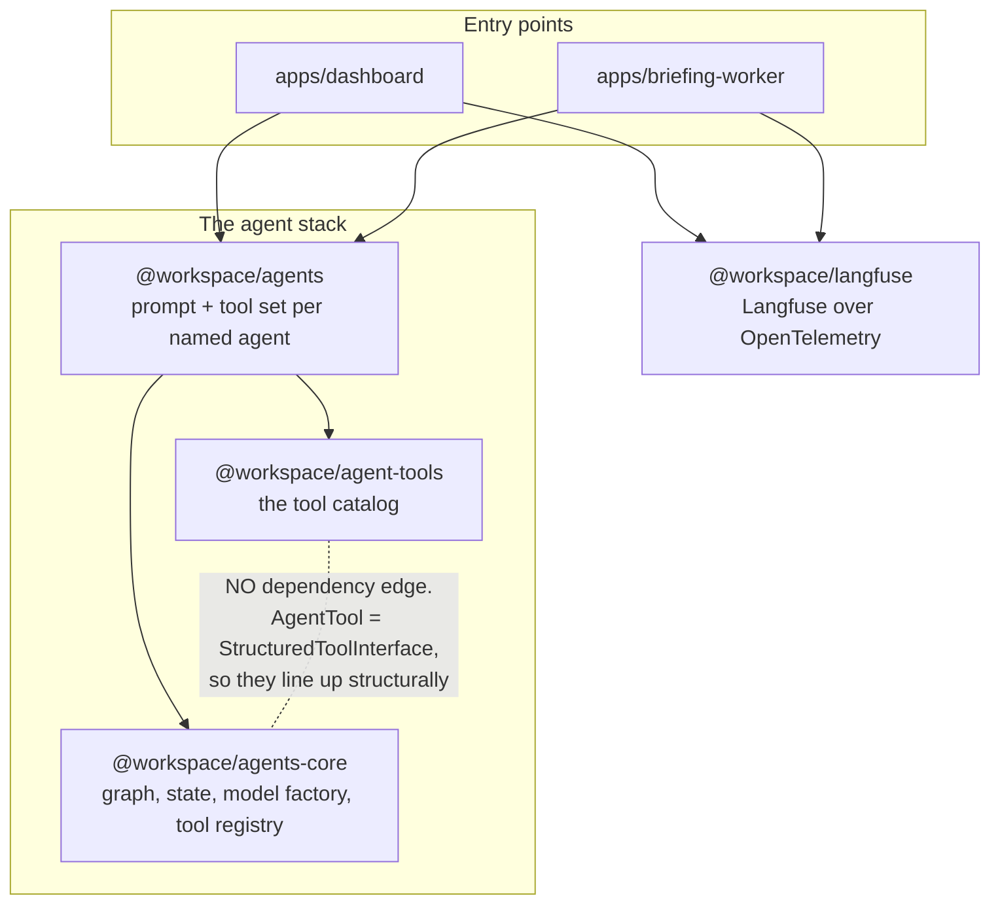
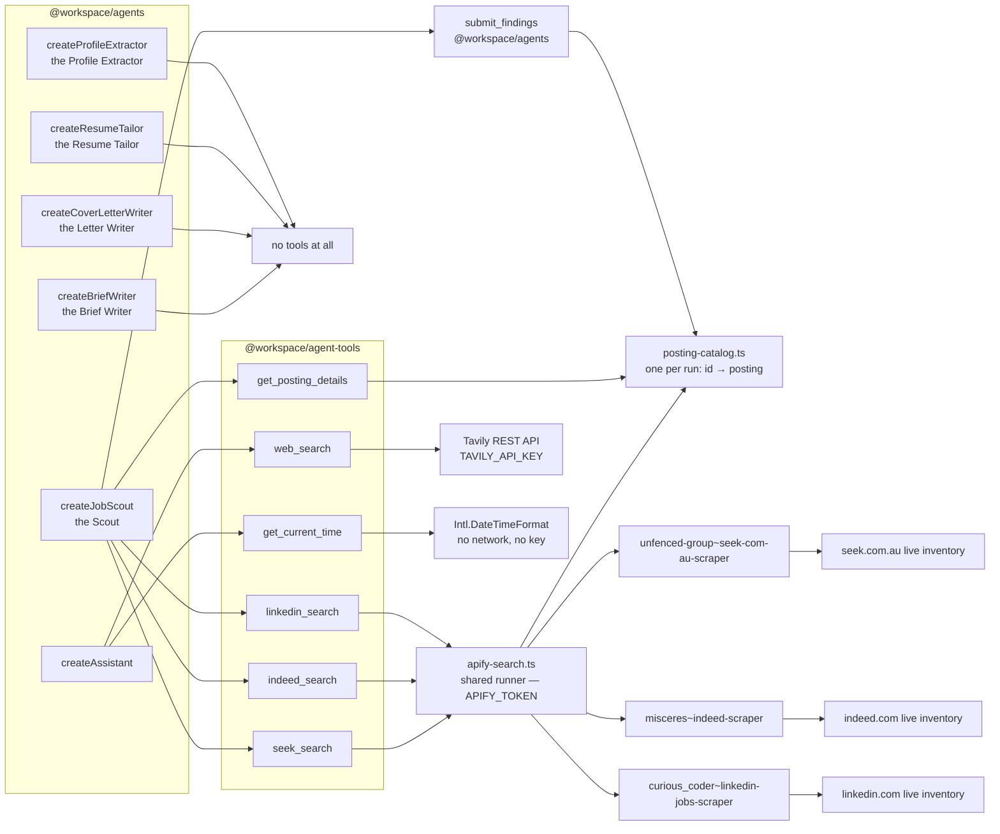
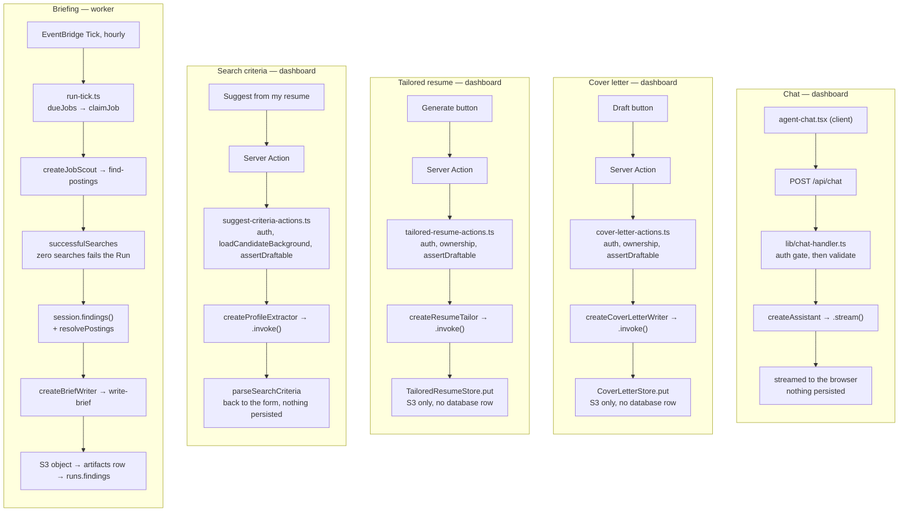
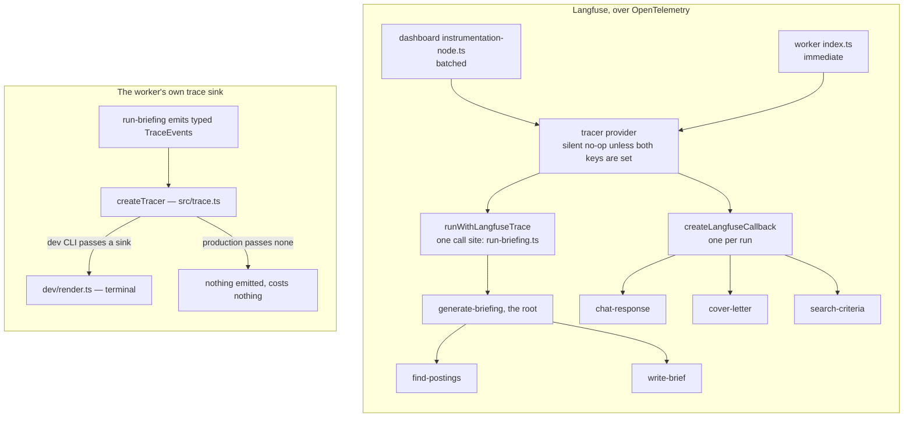

# Agent architecture

How the agent stack fits together: which packages depend on which, what the
runtime graph does, which agent carries which tools, who invokes them, and how a
run is traced.

`OVERVIEW.md` maps the product pipeline and shows the agents as two boxes. This
is the view underneath that — the packages, the graph, and the tool catalog.

Vocabulary follows `CONTEXT.md`. In particular a **Job** is a row in `jobs`, a
thing that runs on a cadence, and never an employment opportunity — that is a
**Posting**.

---

## 1. Package layering

Three layers, plus tracing off to one side. The direction of the arrows is the
design, and so is one arrow that is deliberately missing.

Three things this picture is making explicit:

- **`agent-tools` does not depend on `agents-core`.** Tools are plain LangChain
  tools, and `AgentTool` in the runtime is a type alias for the same
  `StructuredToolInterface`. The two fit structurally, not by dependency, so the
  catalog works with any caller and the runtime ships no tools at all
  (`createAgent({ tools })` defaults to none).
- **Neither app declares `agents-core` or `agent-tools`.** Both list only
  `@workspace/agents` and `@workspace/langfuse`; the lower layers arrive
  transitively. That is the layering holding.
- **`@workspace/langfuse` has no edge to the stack in either direction.** It is a
  composition-root concern, which is why `@langfuse/*` and `@opentelemetry/*`
  stay out of the runtime entirely.

Only `agents` and `agent-tools` expose wildcard `./*` subpaths. `agents-core`
and `langfuse` expose `"."` alone — which is why every consumer imports those two
from the root.

---

## 2. The runtime graph

`createAgent` in `packages/agents-core/src/agent.ts` builds and compiles one
LangGraph. This is it, node for node.

State is two fields (`state.ts`): `messages`, using the prebuilt message-aware
reducer so a node returns only what it produced, and `llmCalls`, which
accumulates via a summing reducer purely so the router can stop a runaway loop.

**The tool node runs calls in parallel.** Models emit several tool calls at once;
all are dispatched concurrently and returned in one update, so every `tool_use`
gets its matching `tool_result`.

**`halt` is the interesting node.** When the budget is gone the run is diverted
there rather than simply ending, because ending would leave the last tool calls
unanswered — and an unanswered tool call is rejected on the next turn. `halt`
answers each one with a `status:"error"` ToolMessage saying the budget ran out,
so the transcript stays well-formed.

| Budget                    | Value | Why                                                                                                                                                                                                                                                                                                                                                                                                                               |
| ------------------------- | ----- | --------------------------------------------------------------------------------------------------------------------------------------------------------------------------------------------------------------------------------------------------------------------------------------------------------------------------------------------------------------------------------------------------------------------------------- |
| `DEFAULT_MAX_LLM_CALLS`   | 5     | Sized for a question with one tool round trip                                                                                                                                                                                                                                                                                                                                                                                     |
| `JOB_SCOUT_MAX_LLM_CALLS` | 10    | The Scout's _floor_, not its budget. It makes one focused search per role title, location and **board**, so the worker sizes the real figure with `scoutLlmCallBudget()` — `titles × locations × boards + 6`, never below this and never above `MAX_SCOUT_LLM_CALLS`. The `+ 6` is the turns that are not searches: reading the brief, reading the shortlist back with `get_posting_details`, submitting, and the line it ends on |

The tool registry (`tools.ts`) is the other containment point. Duplicate tool
names **throw at construction** rather than silently shadowing each other. After
that nothing a tool does can break the run: an unknown tool name and a tool that
throws both come back as `status:"error"` ToolMessages.

The model is a `ChatOpenAI` on `gpt-5.4-mini` (`model.ts`). `temperature` is
deliberately never set — reasoning-capable models reject any non-default value.

---

## 3. Agents and their tools

Six agents. What separates them is mostly which tools they carry, and **tool
scope here is a containment boundary rather than a tuning knob.**

**The three board tools are one implementation, not three.** `apify-search.ts`
owns the token, the timeout, the result clamp, the failure split and the
rendering; a board file supplies only an `ApifyBoardSpec` — an actor id, a
request body and a field mapping. They take the same five inputs deliberately,
so the model does not have to learn a different search per board. Adding a board
is a spec, a factory, and a line in `JOB_SCOUT_SEARCH_TOOL_NAMES`.

**A search returns two lines per posting, not the advertisement.** Every result
is recorded in the run's `PostingCatalog` and rendered as an id, a listing date
and a teaser; the advertisement itself is read back by id through
`get_posting_details`, for the shortlist alone. Descriptions were already
arriving in the same actor call, so this costs no extra scrape — what it saves
is context, and a transcript is re-sent to the model on every turn. It also
stops sixty advertisements' worth of boilerplate sitting between the model and
the handful of facts it ranks on.

Two consequences beyond the cost. **No URL is ever shown to the model** — a
posting is named by its id, and the worker resolves the id back to the URL the
board issued, so the transcription failures recorded in `resolve-postings.ts`
have nothing left to go wrong in. And the board tools are **factories** rather
than module singletons, because each is bound to one run's catalog.

| Agent                     | Tools                                                          | Why that set                                                                                                                                                                                                                                                                                                                                                                                                                    |
| ------------------------- | -------------------------------------------------------------- | ------------------------------------------------------------------------------------------------------------------------------------------------------------------------------------------------------------------------------------------------------------------------------------------------------------------------------------------------------------------------------------------------------------------------------- |
| `createJobScout`          | three board searches, `get_posting_details`, `submit_findings` | One search tool per board, one reader for what they returned, and one way to report. Read-only **outside the run** by construction: no tool reaches the network except to search, so "the Scout returns data and performs no side effects" is structural rather than a prompt rule someone can talk it out of. `submit_findings` does not weaken that — it writes to a variable `createJobScout` owns, and reaches nothing else |
| `createBriefWriter`       | `[]`                                                           | Cannot search, so it cannot quietly supplement thin Findings with something half-remembered; cannot write, so uploading stays with the worker                                                                                                                                                                                                                                                                                   |
| `createCoverLetterWriter` | `[]`                                                           | Prompt-injection containment — see below                                                                                                                                                                                                                                                                                                                                                                                        |
| `createResumeTailor`      | `[]`                                                           | The Letter Writer's case, unchanged: the same CV, the same advertisement copied verbatim beside it                                                                                                                                                                                                                                                                                                                              |
| `createProfileExtractor`  | `[]`                                                           | The same containment, at full strength: it holds the candidate's whole CV verbatim and the uploaded file is itself the untrusted input                                                                                                                                                                                                                                                                                          |
| `createAssistant`         | `allTools` + `extraTools`                                      | The one genuinely general-purpose agent                                                                                                                                                                                                                                                                                                                                                                                         |

### Why the Letter Writer, the Resume Tailor and the Profile Extractor have no tools

The strongest case in the stack, and it is one argument covering three agents.
All three hold the candidate's CV in their context, and **an agent that can both
read a CV and issue an outbound request can be induced to put one inside the
other.** None of them needs to look anything up to do its job, so none is given
the means to.

**The Letter Writer and the Resume Tailor** have attacker-influenced text sitting
beside the CV. The Posting is written by anyone who can pay to place an
advertisement, and its highlights reach both prompts **verbatim** rather than
laundered through a paraphrase, so an instruction hidden in a bullet point
survives intact. Having no tools is exactly what makes copying the advertisement
acceptable: injected text can shape the prose of a document the user then reads
and edits, and can reach nothing else.

They are one case rather than two, and the Resume Tailor is if anything the
sharper half: it holds the CV whole and its output is a rewrite of that CV, so
the amount of the candidate's own data in play is the same as the Profile
Extractor's while the untrusted advertisement sits alongside it. What differs
between the two is only what a bad output _costs_ — a letter is prose a reader
weighs, and a resume is read as a list of facts — and that difference is handled
in the prompt rather than in the tool set.

**The Profile Extractor** has no second document at all — it has the CV, whole
and verbatim, including whatever address, phone number and employment history it
carries. That is the strongest version of the same case rather than a weaker one:
the uploaded file _is_ the injection surface, it arrives from outside the system,
nothing sanitises it, and a closed signup is no help, because a person can be
handed a document as easily as they can write one. So the document with the most
to leak is read by the agent with no way to leak it, and what comes back is a
JSON object the user reviews in a form before anything is saved.

Both prompts also tell the model to treat the outside text as quoted material,
and `toProfilePrompt()` fences the CV in the same idiom — but a fence is a label,
not a boundary, and nothing stops a document from writing one of its own. The
containment is the empty tool list, and both are asserted structurally, in
`cover-letter-writer.test.ts`, `resume-tailor.test.ts` and
`profile-extractor.test.ts`, rather than left to a comment.

When a page fetcher eventually exists it belongs on a separate agent that never
sees the profile, handing them validated data.

### The same idea one level down

The board tools narrow their own reach the same way. The Apify actors behind them
accept webhook, Telegram and Slack notification fields; no tool ever sends them.
Each tool's Zod input schema is that board's entire reach — which is what keeps
the no-side-effects property structural at the tool layer too, and putting the
request body in one shared runner means it is one place to check rather than
three.

### Two notes on the catalog

- **The board tools are not in `allTools`.** `allTools` is
  `[getCurrentTime, webSearch]`, and each board tool is reached only through its
  wildcard subpath — `@workspace/agent-tools/seek-search` and its two neighbours,
  which is how `job-scout.ts` imports them. So the assistant, which carries
  `allTools`, cannot search any job board. Worth knowing before reading
  `allTools`' docstring, which still calls itself "every tool in the catalog".
- **Agents are `createX()` factories, never instances.** Building one constructs
  a model, which reads `OPENAI_API_KEY` and throws without it. A module-level
  instance would move that failure to import time and break any consumer that
  merely imports the module. Every tool reads its key inside the call for the
  same reason, so importing the catalog is always free.

---

## 4. Who invokes what

Five entry points. They differ in how they import, how they call, and what they
persist.

**Chat** streams, because the assistant has tools and the interesting part is
watching it work. **Every other entry point uses `.invoke()`, not `.stream()`**
— with no tools the graph is just `START → model → END`, so there is nothing to
watch. **The worker is the only place two agents run in sequence**, scout then
writer, with a validation step between them.

**The cover letter and the tailored resume are the same path twice, and they
share the parts where getting it wrong is expensive.** Both re-read the Posting
through `lib/postings/load-stored-posting.ts` — one identifier out of the form,
the advertisement out of `postings.payload`, ownership structural in the natural
key — and both read the CV through `loadCandidateBackground()` **before** the
agent is constructed, so a user with nothing to write from costs no model call.
What they do not share is a store, a kind or an IAM grant: two documents for one
Posting need two addresses, or one would overwrite the other.

**The criteria suggestion is the only entry point that persists nothing**, and
that is the feature rather than an omission. It answers into the new-briefing
form; the user edits what came back and `jobs.config` is written by the ordinary
create action if they press Create. So there is nothing to invalidate and the
action calls no `refresh()` — and a suggestion someone abandons leaves no trace
anywhere. It reuses `loadCandidateBackground()` and `assertDraftable` from the
cover-letter path rather than growing a document picker, so "which document is my
resume" answers the same in both places.

Import style differs by app and both are correct: the dashboard uses wildcard
subpaths (`@workspace/agents/cover-letter-writer`,
`@workspace/agents/profile-extractor`), the worker uses the root barrel.

Two invariants the worker enforces, both of which exist because a plausible
fabrication is worse than an empty result:

- **The Scout never handles a URL.** It reports the id a search gave it, and
  `resolve-postings.ts` looks that id up in the run's catalog to get the URL the
  board issued — so there is no transcription step left to get wrong, and an
  invented id names nothing. That module records why: comparing URLs on
  `postingId()` fixed seven runs lost to mistyped LinkedIn tracking parameters,
  and not showing the model a URL at all makes them unrepeatable. The Run
  survives a drop and carries a warning naming it; only a Run with nothing left
  at all fails.
- **A Run with no successful search fails.** This is why
  `JOB_SCOUT_SEARCH_TOOL_NAMES` is exported at all: `search-results.ts` counts
  evidence against the Scout's real tool set rather than a list maintained
  separately, which would drift silently the first time a board was added.
  `extraTools` is deliberately excluded from it, so nothing a caller passes can
  satisfy the check.

---

## 5. Tracing

Two independent mechanisms. Neither feeds the other, both are opt-in, and
neither is ever load-bearing.

Langfuse is gated on `LANGFUSE_PUBLIC_KEY` and `LANGFUSE_SECRET_KEY`. Without
both, all four functions are **silent no-ops rather than errors** —
`createLangfuseCallback` returns `undefined`, which is why call sites spread
`...(callback ? { callbacks: [callback] } : {})`.

The worker exports `immediate` and the dashboard `batched` because a Lambda can
be frozen the moment the handler returns; the dashboard is a long-lived process
that can afford to batch. The worker calls `shutdownLangfuse()` in a `finally`
beside `prisma.$disconnect()` to flush what is queued.

The briefing Run is wrapped so the Scout and the Brief Writer nest under a single
`generate-briefing` root rather than arriving as two unrelated traces. The three
dashboard traces need no such root: each is one agent answering one request.

**Two of those traces carry the candidate's CV**, `cover-letter` and
`search-criteria`, and Langfuse retains full prompts by design. Whether that text
leaves the machine is decided entirely by whether the two keys are set — which is
the one place the no-op default is a privacy property and not merely a
convenience.

The trace sink is held to the same standard from the other direction: it is
synchronous and returns nothing, because a sink that could be awaited is a sink
that can stall a Run, and `createTracer` wraps it so that a sink which throws is
ignored for the rest of the Run rather than taking a paid, at-most-once execution
down with it.

---

## Where things live

| Package                | Holds                                                                                                                                                                                                                                                                                      |
| ---------------------- | ------------------------------------------------------------------------------------------------------------------------------------------------------------------------------------------------------------------------------------------------------------------------------------------ |
| `packages/agents`      | `assistant`, `job-scout`, `brief-writer`, `cover-letter-writer`, `resume-tailor`, `profile-extractor`, plus the two schema contracts — `findings` (Scout → Brief Writer) and `criteria` (Profile Extractor → whoever stores them) — and `cover-letter`, `tailored-resume` and `posting-id` |
| `packages/agents-core` | `agent.ts` (graph), `state.ts`, `model.ts`, `tools.ts` (registry), `env.ts`                                                                                                                                                                                                                |
| `packages/agent-tools` | `seek-search.ts`, `indeed-search.ts` and `linkedin-search.ts` over the shared `apify-search.ts`; `web-search.ts`, `time.ts`, and `index.ts` with `allTools`                                                                                                                                |
| `packages/langfuse`    | `initializeLangfuse`, `createLangfuseCallback`, `runWithLangfuseTrace`, `shutdownLangfuse`                                                                                                                                                                                                 |
