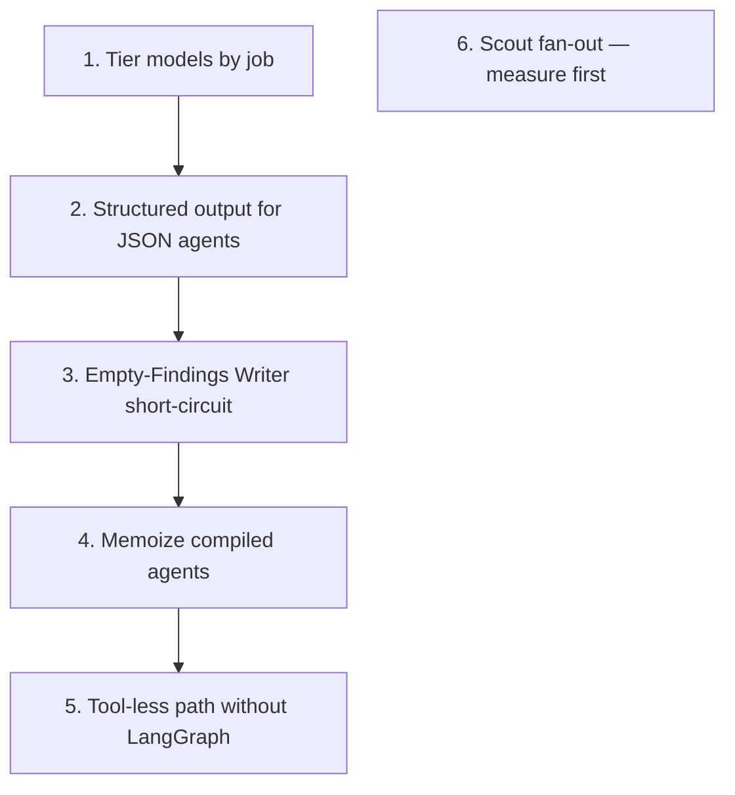

# Agent optimisation opportunities

> ## Not built. This is a plan, not a description of the code.
>
> Nothing below changes defaults, call sites, or the runtime today. The present
> tense of the _current behaviour_ sections describes what the stack does; the
> proposals describe what it could do. Delete or rewrite this file when the work
> ships — `CLAUDE.md` §Repo context is where that convention lives.

Companion to [`docs/agent-architecture.md`](./agent-architecture.md), which
explains how the stack is shaped. This file is about where cost, latency, and
failure modes concentrate, and what would move them without undoing the
containment boundaries that architecture document is careful about.

Vocabulary follows [`CONTEXT.md`](../CONTEXT.md). In particular a **Job** is a
row in `jobs`, never an employment opportunity — that is a **Posting**.

---

## Current picture

Every named agent in `@workspace/agents` constructs through `createAgent` in
`@workspace/agents-core`, which falls back to `createModel()` when no model is
passed. `createModel` is a `ChatOpenAI` on a single default:

```5:6:packages/agents-core/src/model.ts
/** Default chat model. Override per-call via {@link ModelOptions.model}. */
export const DEFAULT_MODEL = "gpt-5.4-mini"
```

No factory currently overrides that default. Callers _can_ pass `model` (it
flows through `CreateAgentOptions`), and none do.

| Agent               | Entry point                                        | Tools        | Output shape                         |
| ------------------- | -------------------------------------------------- | ------------ | ------------------------------------ |
| Scout               | `createJobScout` — briefing worker                 | `seekSearch` | JSON Findings in the final message   |
| Brief Writer        | `createBriefWriter` — briefing worker              | none         | Markdown Brief                       |
| Profile Extractor   | `createProfileExtractor` — suggest-criteria action | none         | JSON SearchCriteria in final message |
| Cover Letter Writer | `createCoverLetterWriter` — cover-letter actions   | none         | Markdown letter                      |
| Assistant           | `createAssistant` — `/api/chat`                    | `allTools`   | Open chat stream                     |

Three of the five never call a tool. Two of those three are asked for JSON and
parse it out of prose. The briefing pipeline always pays for two model runs —
Scout, then Writer — even when the Scout returns an empty Findings list.

Suggested order of attack, highest leverage first:

1. Tier models by job
2. Structured output for JSON agents
3. Short-circuit empty Scout results
4. Memoize compiled agents across requests
5. Skip the LangGraph for tool-less agents
6. Tighten Scout search fan-out (prompt / criteria, not a blind budget cut)

What deliberately stays off the list is at the foot of this file.

---

## 1. Tier models by job

### Current behaviour

One reasoning-capable OpenAI model serves every agent. `temperature` is never
set (reasoning-capable models reject a non-default value); `maxTokens` is left
unset, so on those models the output cap also covers reasoning tokens and a
tight cap would truncate the answer. See `packages/agents-core/src/model.ts` and
the Model configuration section of `packages/agents-core/README.md`.

### Why it matters

The five agents do qualitatively different work:

| Agent               | What the model actually does                                    | What it does _not_ need                          |
| ------------------- | --------------------------------------------------------------- | ------------------------------------------------ |
| Scout               | Multi-step tool use, filter SEEK results, refuse to invent URLs | —                                                |
| Assistant           | Open-ended chat with tools                                      | —                                                |
| Brief Writer        | Render already-validated Findings as markdown                   | Tool use, open-world judgment, deep reasoning    |
| Profile Extractor   | Map one CV to a short JSON object                               | Tool use; long multi-step deliberation           |
| Cover Letter Writer | First-person prose from CV + Posting                            | Tool use; less need for a reasoning-tier default |

Paying a reasoning-capable default for “turn this JSON into three paragraphs of
markdown” and “emit this Zod-shaped object from a CV” is the single largest
cost and latency concentration in the stack. The Scout and the Assistant are
the ones that actually exercise what that model is for.

### Proposal

Give each factory a default model (or a `createModel({ model })` call) matched
to its job, still overridable through the existing `model` option so tests and
call sites stay injectable:

- **Scout** — keep a capable tool-calling model; consider a stronger one if
  search quality is the constraint rather than cost.
- **Assistant** — mid/capable; tools and open chat both matter.
- **Brief Writer** — cheaper, faster, non-reasoning chat model.
- **Profile Extractor** — cheaper model, ideally paired with structured output
  (§2).
- **Cover Letter Writer** — mid-tier: quality-sensitive prose, but still a
  single-shot, no-tools call.

The seam already exists. `createAgent({ model })` accepts any `ChatModelLike`;
factories spread `...rest` into it. The change is choosing defaults per factory
(and documenting them next to `DEFAULT_MODEL`), not inventing a new options
shape.

### Risks

- A cheaper model that hedges, pads, or ignores “JSON and nothing else” will
  raise parse failures on the Extractor and Scout until §2 lands — land
  structured output first, or together, for those two.
- Cover-letter quality is user-visible and hard to regress-test without evals;
  change that default behind a comparison, not a silent swap.
- `DEFAULT_MODEL` in `agents-core` remains the runtime fallback for anything
  that calls `createAgent` / `createModel` directly — the Assistant and any
  future agent that does not opt in. Do not delete it; narrow what _reaches_
  it.

---

## 2. Structured output for JSON agents

### Current behaviour

The Scout and the Profile Extractor have Zod contracts (`FindingsSchema`,
`SearchCriteriaSchema`) but no structured-output channel. Both comments say so
explicitly:

```11:14:packages/agents/src/findings.ts
 * The scout has no structured-output channel (the graph binds tools and returns
 * messages), so the hand-off travels as JSON in the final message and is parsed
 * here. `jobScoutSchemaDescription` renders this same schema into the scout's
 * prompt, so what is asked for and what is accepted cannot drift apart.
```

```14:18:packages/agents/src/criteria.ts
 * The extractor has no structured-output channel (the graph binds tools and
 * returns messages), so the hand-off travels as JSON in the final message and
 * is parsed here. `criteriaSchemaDescription` renders this same schema into the
 * extractor's prompt, so what is asked for and what is accepted cannot drift
 * apart.
```

In practice that means:

1. The system prompt carries a rendered JSON Schema on every call.
2. The model is told to return “JSON and nothing else”.
3. Callers strip optional fences (`parseFindings`, `parseSearchCriteria`) and
   validate with Zod.
4. A well-formed-looking but unparseable answer fails the run (Scout) or the
   action (Extractor) after the tokens are already spent.

The graph always `bindTools`s, even when the tool list is empty, and always
returns messages. There is no path today that asks the provider for
`response_format` / `withStructuredOutput`.

### Why it matters

Schema-in-prompt tokens are paid on every Extractor suggest and every Scout
final turn. Fence-stripping exists because models wrap JSON anyway. Parse
failures are a pure waste: the search work (Scout) or the CV read (Extractor)
already happened.

Structured output would move “is this the right shape?” from a post-hoc Zod
parse of prose to the provider’s constrained decode (or to a final tool whose
args _are_ the schema). The Zod schemas stay — they remain the contract the
worker and the suggest-criteria action trust — but the prompt no longer has to
restate them, and fence-stripping becomes unnecessary.

### Proposal

Two workable shapes; pick one and apply it to both JSON agents so the hand-off
idiom stays one idiom:

1. **Provider structured output on tool-less agents.** The Profile Extractor is
   the easy case: `tools: []`, single shot, Zod schema already in hand. A
   dedicated invoke path (or a narrow helper beside `createAgent`) that uses
   `withStructuredOutput(SearchCriteriaSchema)` removes the schema-in-prompt
   and the fence parser in one move.
2. **Final tool / structured final message for the Scout.** The Scout must keep
   real tools for searching. Constrained decode on the _whole_ run fights tool
   calling. Options that preserve the search loop:
   - a terminal tool whose arguments are `FindingsSchema` (model calls
     `report_findings` instead of emitting prose JSON), or
   - structured output only on the last model turn once the Scout has stopped
     calling search tools (requires a graph change so the final turn is not a
     free-form `AIMessage`).

Either way, keep the worker’s post-conditions that structured output cannot
express: at least one successful search round trip, and every Posting URL
appearing verbatim in a search result. Those stay in
`apps/briefing-worker/src/run-briefing.ts` regardless of how the JSON arrives.

### Risks

- A terminal Findings tool is a new tool the Scout can call too early or
  instead of searching. The worker’s “searches === 0 ⇒ fail” check still
  catches fabrication, but the prompt and tool description have to make “search
  first” structural where possible.
- Changing `parseFindings` / `parseSearchCriteria` call sites without keeping
  a prose fallback will break any in-flight assumption that the final message
  is text. Treat the parsers as the compatibility boundary until every caller
  has moved.
- Do not put structured output on the Brief Writer or Cover Letter Writer —
  their product is prose.

---

## 3. Short-circuit empty Scout results

### Current behaviour

After handoff, `run-briefing.ts` always builds a writer prompt from Findings and
invokes `createBriefWriter`. An empty `postings` list is a legitimate result —
the Scout’s prompt says so, and `FindingsSchema` allows it — and the Brief
Writer’s prompt then asks for “a couple of sentences saying so” and stop.

That is a full model round trip to produce a near-deterministic short string.

### Why it matters

Dry searches are not rare: tight criteria, odd locations, or a board with
nothing recent will all yield empty Findings after real search work. The Scout
call is load-bearing there (it did search; the worker checked). The Writer call
is not — the markdown is a fixed shape.

### Proposal

In the worker, when `findings.postings.length === 0`, skip `createBriefWriter`
and write a small template Brief that:

- states that the search returned nothing worth reporting,
- includes the Scout’s `notes` when present,
- does not invent Postings, salaries, or links.

Still upload through the same Brief store path, still finish the run the same
way, still record Findings. The only thing that disappears is the Writer’s
model call. Trace the step as `writer` with a summary like `template (empty
findings)` so Langfuse and the run report stay honest about what ran.

### Risks

- Tone drift: a hand-written empty Brief will not match the Writer’s voice on
  non-empty runs. Keep the template short and plain; do not try to sound like
  the model.
- Do not short-circuit on Scout _failure_ (no successful search, fabricated
  URL, parse error) — those must still fail the run. Empty Findings after real
  searches are the only case.

---

## 4. Memoize compiled agents across requests

### Current behaviour

Every call site constructs a fresh agent per invocation:

- `createAssistant()` inside each `/api/chat` request
- `createJobScout()` / `createBriefWriter()` inside each briefing run step
- `createProfileExtractor()` inside each suggest-criteria action
- `createCoverLetterWriter({ systemPrompt })` inside each draft action

`createAgent` builds a `ChatOpenAI`, binds tools, and `compile()`s a
`StateGraph`. On Fluid Compute (dashboard) and Lambda (briefing worker), the
process can outlive one request; none of that reuse is taken today.

### Why it matters

Model construction and graph compile are CPU work paid before the first token.
Under reuse they are pure overhead. This is smaller than model-tier or
empty-Writer savings, but it is also local and low-risk if the memo key is
right.

### Proposal

Memoize at the composition root, not inside `createAgent` itself:

- **Assistant, Scout, Brief Writer, Profile Extractor** — process-level
  singleton of the default-configured agent (or of the compiled graph + model
  pair). Factories stay factories for tests; the app/worker holds the memo.
- **Cover Letter Writer** — do **not** memoize the personalized agent. Its
  `systemPrompt` is per-user via `coverLetterSystemPrompt(extras)`. Memoize a
  base writer if useful, and pass the composed prompt per call; or keep
  constructing, since the prompt string is the varying part and must not leak
  across users.

Keep the injectable seams (`ChatHandlerDeps.createAgent`,
`SuggestCriteriaActionsDeps.createExtractor`, worker `createScout` /
`createWriter`) so tests still pass fakes without fighting a module singleton.

### Risks

- Memoizing a Cover Letter Writer that closed over one user’s instructions
  would be a cross-user prompt leak. Key on nothing user-specific, or don’t
  memoize that path.
- A singleton that captured `OPENAI_API_KEY` at first use will ignore a later
  env change in dev; acceptable for production processes, surprising in
  long-lived `next dev`. Document it or reset on key change in development.
- Do not move construction to module import time in `@workspace/agents` —
  factories exist specifically so a missing `OPENAI_API_KEY` fails at run time,
  not when a Next.js route is merely imported. Memoize in the app/worker after
  the first real use.

---

## 5. Skip the LangGraph for tool-less agents

### Current behaviour

Brief Writer, Profile Extractor, and Cover Letter Writer all call `createAgent`
with `tools: []`. The compiled graph is still `START → model → END`: one model
node, a tools node that never runs, a halt node that never runs, and a
`bindTools([])` on the way in. Architecture docs already note that call sites
use `.invoke()` rather than `.stream()` for exactly this reason — there is no
tool loop to observe.

### Why it matters

For these three, LangGraph is ceremony around a single chat completion. The
cost is mostly clarity and a little CPU (especially when combined with
per-request construction in §4), not tokens. The win is a narrower path: a
plain model invoke (and, for the Extractor, a natural place to attach
structured output from §2) without pretending there is an agent loop.

### Proposal

Add a small helper in `agents-core` — or a convention in each factory — for
“system prompt + one human message → AI message”, used only when `tools` is
empty. Keep returning something the call sites can treat like today’s result
(`messages`, and `llmCalls: 1`) so the worker’s `runAgent` / dashboard actions
do not fork their tracing.

Alternatively, keep `createAgent` for API uniformity and only collapse the
graph when `tools.length === 0` inside `createAgent` itself. That preserves
every factory signature and still drops compile/`bindTools` work.

Prefer pairing this with §2 for the Extractor: the tool-less path is where
structured output fits cleanly; the Scout keeps the full graph.

### Risks

- Tracing and Langfuse callbacks currently hang off the LangGraph run. A plain
  `ChatOpenAI.invoke` must still accept `callbacks` / `metadata` / `runName` or
  those spans disappear for the Writer and Extractor.
- Tests that assert `bindTools` was called with `[]` (cover-letter-writer and
  profile-extractor suites) encode the current containment proof. A non-graph
  path needs an equivalent structural assertion — “this agent cannot dispatch
  a tool” — not a deleted test.
- Do not collapse the Scout or Assistant graphs. Tool loops and halt behaviour
  are load-bearing there.

---

## 6. Tighten Scout search fan-out

### Current behaviour

`JOB_SCOUT_MAX_LLM_CALLS = 10` raises the runtime default of 5 because a Scout
is expected to make several focused searches — roughly one per role title and
location — and each search costs a model call. The default budget would divert
the run to `halt` mid-search and still produce a partial answer that looks
well-formed. Parallel tool calls are already supported by the tools node.

The Profile Extractor already caps what it proposes (at most six titles, at
most twelve keywords) so the Scout’s fan-out has an upstream bound when
criteria came from Suggest. Hand-authored job config on the settings form does
not have to respect those caps the same way.

### Why it matters

The Scout is the expensive agent: each turn is a model call plus a SEEK scrape
via Apify. Cutting `JOB_SCOUT_MAX_LLM_CALLS` without changing search behaviour
just increases halt rate. Real savings come from fewer, better searches — which
is a criteria and prompt problem, not a budget problem.

### Proposal

Treat this as product work with an observability check, not a constant tweak:

- Prefer criteria quality upstream (Extractor caps, form validation) so the
  Scout is not handed eight titles × three locations.
- Prompt the Scout to collapse equivalent locations or skip a title when early
  searches already cover it — carefully, without encouraging it to invent
  Postings to “finish”.
- Use Langfuse (llm call counts, searches-by-source already traced in the
  worker) to see whether runs commonly approach 10 or usually finish in 3–4;
  only then consider lowering the ceiling.
- Do not lower the budget to “save money” while empty-Writer short-circuit and
  model tiering are still on the table — those move more cost with less risk to
  Findings quality.

### Risks

- A Scout that stops early under a tighter budget produces partial Findings that
  still parse and pass URL checks — the failure mode the raised budget was
  invented to avoid. Any budget change needs a halt-rate signal, not only a
  cost signal.
- Collapsing searches in the prompt can fight “one focused search per title and
  location”. Prefer upstream criteria discipline over teaching the Scout to
  second-guess its brief.

---

## Deliberately not on this list

These look like optimisations and are not. Changing them would undo properties
the architecture treats as load-bearing.

- **Empty tool sets on the Brief Writer, Cover Letter Writer, and Profile
  Extractor.** Containment, not waste. An agent that can read a CV and issue an
  outbound request can be induced to put one inside the other. See
  `docs/agent-architecture.md` §3.
- **Verbatim CV and Posting text in prompts.** Quality and injection-boundary
  choices. Summarising a CV before extracting criteria would put this package
  in the business of deciding which roles matter; laundering `highlights`
  would hide advertisement text that the letter writer must treat as quoted
  material.
- **Assistant’s `allTools`.** The catalog is two tools today
  (`getCurrentTime`, `webSearch`). Revisit only when the catalog grows enough
  that tool choice degrades.
- **Moving agent construction to module scope in `@workspace/agents`.** Would
  make a missing `OPENAI_API_KEY` fail at import time and break any consumer
  that merely imports the module.
- **Dropping the worker’s search-evidence and verbatim-URL checks** in favour of
  trusting structured output. Structured output constrains shape, not
  truthfulness.

---

## Suggested sequencing



1 and 2 are the token and failure-mode wins; do the Extractor’s structured
output before or with any cheaper Extractor model. 3 is a small, isolated
worker change. 4 and 5 are CPU/clarity. 6 waits on traces.

When a slice ships, either delete the matching section here or replace this
file with a short “what we changed” note and let git history hold the plan —
same rule as `docs/job-kind-registry-plan.md`.
