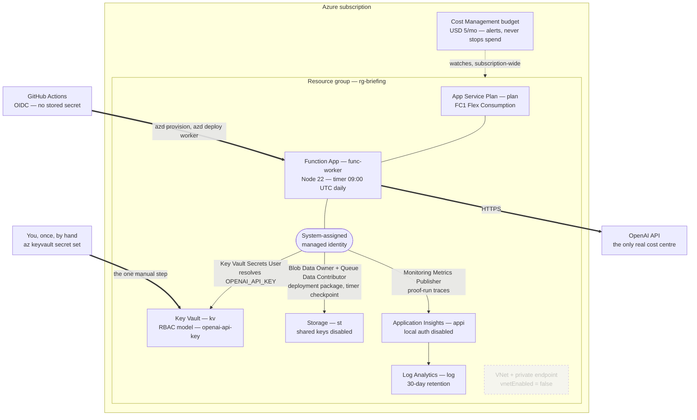

# Azure foundation

Bicep behind `azd`, for the scheduled `@workspace/briefing-worker` service.
`azure.yaml` at the repo root is the manifest; everything here is what it
provisions.

| File                 | Role                                                       |
| -------------------- | ---------------------------------------------------------- |
| `main.bicep`         | Subscription-scoped entry point; resource group and budget |
| `app/worker.bicep`   | Flex Consumption function app, Node 22, system-assigned MI |
| `app/keyvault.bicep` | Empty RBAC-model vault — never the secret value            |
| `app/rbac.bicep`     | All role assignments, including Key Vault Secrets User     |
| `app/vnet.bicep`     | Only when `vnetEnabled` — off by default                   |

Adapted from `Azure-Samples/functions-quickstart-typescript-azd-timer`.

Node 22 on Flex Consumption in `australiaeast` was confirmed before pinning it,
and is the platform default there:

```
$ az functionapp list-flexconsumption-runtimes --location australiaeast --runtime node
Default    Name    Version    EndOfLifeDate
---------  ------  ---------  ------------
False      node    24         2029-04-30
True       node    22         2027-04-30
False      node    20         2026-04-30
```

## Topology



Every arrow inside the resource group leaves from the managed identity, and
that is the whole security story: storage has `allowSharedKeyAccess: false`,
App Insights has `disableLocalAuth: true`, and the vault is RBAC-only. There is
no connection string or account key anywhere in the template, in azd's
environment files, or in the pipeline. The one secret that does exist — the
OpenAI key — is written by hand and read through a `@Microsoft.KeyVault`
reference the app resolves with that same identity.

The budget is drawn against the subscription rather than the resource group on
purpose: it catches a portal experiment or a mistyped `az` command that lands
outside this deployment.

## Naming

The starter's own scheme is kept rather than a hand-invented one: CAF
abbreviations plus `resourceToken`, where the token is
`uniqueString(subscription().id, environmentName, location)`. Only the resource
group carries the environment name.

```
rg-briefing            resource group
func-worker-<token>    function app
st<token>              storage (a Functions platform requirement)
appi-<token>           Application Insights
log-<token>            Log Analytics
plan-<token>           Flex Consumption plan
kv-<token>             Key Vault
```

`kv-<token>` is 16 characters, comfortably inside Key Vault's 24-character cap.
The cap was only ever a risk under a hand-written `kv-briefing-<token>`.

## First provision

```bash
azd env select briefing                    # australiaeast, already created
azd env set BUDGET_ALERT_EMAIL you@example.com
azd provision
```

**If you provision from CI rather than locally, run `azd env refresh`
afterwards.** A provision writes the template's outputs — `AZURE_KEY_VAULT_NAME`,
`AZURE_FUNCTION_NAME` and the rest — into `.azure/<env>/.env` on the machine
that ran it. A CI runner is deleted when the job ends, so those outputs go with
it and your local file still holds only the values you set by hand. Every
`$(azd env get-value ...)` below then expands to an empty string. `azd env
refresh` reads the outputs back out of the deployment record in Azure and is
also the fix after a fresh clone or on a second machine.

`budgetAlertEmail` has no default, so azd prompts for it on a first provision
and the cost guardrail cannot go missing because a step was forgotten.

Setting it to an empty string explicitly is the escape hatch if the Free Trial
offer rejects Cost Management budgets — the deployment fails fast on the budget
resource, and an empty value skips it. Re-set it after converting to
pay-as-you-go, which is exactly when the guardrail starts to matter: the trial's
spending limit is the only hard ceiling, and it disappears on conversion.

## The one manual step

The `OPENAI_API_KEY` value is set once, by hand, and never by a pipeline:

```bash
az keyvault secret set \
  --vault-name "$(azd env get-value AZURE_KEY_VAULT_NAME)" \
  --name openai-api-key \
  --value '<the key>'
```

Pass the value via `"$(pbpaste)"` or a file rather than typing it as a literal
argument — an argument lands in shell history and in terminal scrollback, and
scrollback gets pasted into chats and issues. That is the one route this whole
arrangement cannot defend against.

Bicep provisions the vault and the role assignments; the value exists in exactly
one place. The function app reads it through an app setting that is a
`@Microsoft.KeyVault(SecretUri=...)` reference, resolved by the app's own
system-assigned identity holding **Key Vault Secrets User**. The URI carries no
version, so rotating the secret needs no redeploy.

**Key Vault's RBAC model does not grant secret access to subscription Owner.**
Data-plane access is a separate role, so `rbac.bicep` grants the deployer
**Key Vault Secrets Officer** — but only when the deployer is a `User`. In CI
the deployer is the pipeline's service principal, and giving that principal the
ability to read or write secrets would undo the reason this step is manual.
Role assignments are eventually consistent; a 403 immediately after provisioning
usually just means waiting a minute.

Then deploy:

```bash
azd deploy worker
```

**A Key Vault reference caches its failure.** App Service resolves these
references when the app starts. If the app started before the secret existed —
which is the normal order on a first deployment — the setting stays pinned at
`SecretNotFound` no matter what is in the vault now. It reads exactly like a
permissions problem and is not one. Restart, then check:

```bash
az functionapp restart -g rg-briefing -n "$(azd env get-value AZURE_FUNCTION_NAME)"

az rest --method get --uri "https://management.azure.com/subscriptions/$(azd env get-value AZURE_SUBSCRIPTION_ID)/resourceGroups/rg-briefing/providers/Microsoft.Web/sites/$(azd env get-value AZURE_FUNCTION_NAME)/config/configreferences/appsettings?api-version=2022-03-01" \
  --query "value[?name=='OPENAI_API_KEY'].properties.status" -o tsv
```

`Resolved` is the one word that proves the identity, the role assignment and the
secret all line up.

## Verifying a run

The definition of success is one query, in Application Insights logs:

```kusto
traces
| where timestamp > ago(24h)
| where message has "proof-run"
| project timestamp, message
```

One `"outcome":"success"` row per scheduled slot (09:00 UTC daily). A missing
row means the run never started — which exit codes alone cannot tell you.
Failures also appear as Failed invocations in the function's run history and in
the Failures view. There is no automatic retry and no alerting, by decision: a
failed run waits for tomorrow's slot.

## CI/CD

`.github/workflows/deploy-briefing-worker.yml` deploys on a push to `main` that
touches the worker, the agent packages, or this directory. It authenticates
with OIDC federated credentials, so no service-principal secret is stored.

Set it up with:

```bash
gh auth login                              # azd shells out to the GitHub CLI
azd pipeline config --auth-type federated
```

It creates the app registration plus the federated credential and sets
`AZURE_CLIENT_ID`, `AZURE_TENANT_ID`, `AZURE_SUBSCRIPTION_ID`, `AZURE_ENV_NAME`,
`AZURE_LOCATION` and `BUDGET_ALERT_EMAIL` as repository **variables** — the
workflow reads `vars.*`, and anything created as a secret reads back as an empty
string.

Two things it does that are easy to miss:

- **It writes its own workflow**, `.github/workflows/azure-dev.yml`, and it is
  not the one to keep. It sets up no Node or pnpm, so `azure.yaml`'s
  `prepackage` hook fails on a runner with no pnpm; it runs `azd deploy` with no
  service filter and no path filters. Delete it.
- **It commits with `git add -A`.** Anything unstaged in your tree at that
  moment goes into its commit. Check `git show` afterwards.

### When the login step fails with AADSTS700213

A federated credential matches on an exact subject string, and GitHub now issues
subjects that embed the owner and repository IDs:

```
repo:sunnyeyles@88967314/control-panel@1312572747:ref:refs/heads/main
```

azd registers the older name-based form (`repo:sunnyeyles/control-panel:ref:...`),
which no longer matches anything GitHub sends. Read the actual subject out of the
failed run's log and register it:

```bash
az ad app federated-credential create --id "$(azd env get-value AZURE_PIPELINE_CLIENT_ID)" \
  --parameters '{"name":"control-panel-main-immutable",
                 "issuer":"https://token.actions.githubusercontent.com",
                 "subject":"<the subject from the log>",
                 "audiences":["api://AzureADTokenExchange"]}'
```

The subject is per-ref, not per-repo. That is deliberate: it means someone who
can push a branch still cannot get a token that reaches this subscription. A
`workflow_dispatch` from any branch other than `main` needs its own credential.
