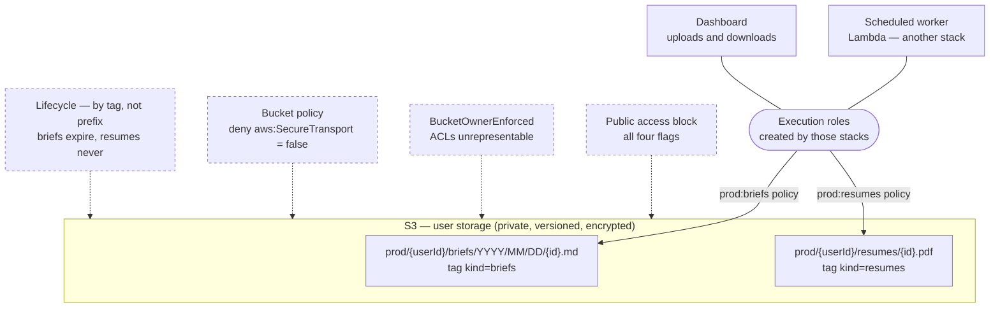

# AWS foundation

Terraform for the AWS side of the migration. Today it provisions one thing: the
private S3 bucket holding per-user data — Markdown briefs the scheduled worker
generates, and documents the user uploads.

> **`infra/` currently holds two stacks.** Everything outside this directory —
> `infra/main.bicep`, `infra/app/*.bicep`, `azure.yaml` — is the live Azure
> Functions deployment, described in `infra/README.md`. This tree does not touch
> it. Decommissioning it belongs to whoever lands the Lambda migration.

```
infra/aws/
  versions.tf providers.tf main.tf variables.tf outputs.tf   the root — thin on purpose
  modules/user-storage/                                      the bucket, its guards, its IAM
```

**The root is deliberately thin.** Everything of substance lives in the module,
so that when the Lambda stack lands beside it this root absorbs a second
`module` block without either side rewriting the other's work.

## What it provisions



| Resource                       | Why                                                                                      |
| ------------------------------ | ---------------------------------------------------------------------------------------- |
| Bucket                         | one bucket, environments separated by the leading key segment                            |
| Public access block            | all four flags, pinned at the bucket rather than trusting the account                    |
| Ownership controls             | `BucketOwnerEnforced` — a `public-read` object is not merely blocked but unrepresentable |
| Versioning                     | an overwrite supersedes and a delete leaves a marker; both are undoable                  |
| Default encryption             | SSE-S3, or a customer-managed KMS key when `kms_key_arn` is set                          |
| Bucket policy                  | denies any request where `aws:SecureTransport` is false                                  |
| Lifecycle **per kind, by tag** | briefs expire after a year; resumes never expire automatically                           |
| IAM per environment            | every kind in that environment — the broad grant                                         |
| IAM per environment **× kind** | one category only — the narrow grant, and the one to prefer                              |

There is no website configuration, no ACL, and no presigned-URL machinery. An
object is read back through the application using the caller's own credentials.

**Encryption defaults to SSE-S3.** It is free, needs no key policy, and
satisfies encryption at rest. Set `kms_key_arn` when a compliance regime demands
a key you control and rotate — worth revisiting now that the bucket holds
uploaded personal documents rather than only generated text. The module then
adds `kms:Decrypt` and `kms:GenerateDataKey` to each access policy and enables
an S3 Bucket Key, which is what keeps per-object KMS calls from dominating the
bill.

## Least privilege, per environment and per kind

Splitting by environment means the identity running production cannot name a
`dev/` key. Splitting by kind means "the scheduled worker can write briefs" and
"the scheduled worker can delete a user's CV" are not the same grant — which
matters more now that one of those is a document the user uploaded.

```json
{
  "Sid": "ReadWriteDeleteOneKind",
  "Effect": "Allow",
  "Action": [
    "s3:PutObject", "s3:PutObjectTagging",
    "s3:GetObject", "s3:GetObjectTagging",
    "s3:DeleteObject"
  ],
  "Resource": "arn:aws:s3:::<bucket>/prod/*/briefs/*"
},
{
  "Sid": "ListOneKindOnly",
  "Effect": "Allow",
  "Action": "s3:ListBucket",
  "Resource": "arn:aws:s3:::<bucket>",
  "Condition": { "StringLike": { "s3:prefix": "prod/*/briefs/*" } }
}
```

Not `s3:*`, and no bucket-level verb. `HeadObject` is authorised by
`s3:GetObject`, so head-before-delete needs no extra grant.
**`s3:PutObjectTagging` is not optional** — the store tags every object with its
kind, the write 403s without it, and the lifecycle rules depend on that tag.

`ListBucket` is a bucket-level action, so its prefix cannot live in the resource
ARN — expressing it as a condition is what stops the grant from enumerating
every environment and every user.

## Retention: why it is tag-based

S3 lifecycle filters match a **literal** prefix and accept no wildcards. The key
layout is `environment/userId/kind/…`, so there is no prefix meaning "every
user's briefs" — `userId` sits between the two fixed parts.

Putting kind above userId would fix lifecycle but scatter a user's data across
kinds, making erasure N deletes instead of one. Keeping userId above kind and
tagging each object with its kind gets both. IAM is unaffected either way: IAM
resource ARNs _do_ take wildcards.

The practical consequence: a kind added to `packages/user-storage/src/kinds.ts`
without a matching entry in `object_kinds` gets **no retention policy at all**.
It will not error; it will just accumulate.

## Applying it

```bash
terraform -chdir=infra/aws init
terraform -chdir=infra/aws plan  -var bucket_name=control-panel-user-storage-<suffix>
terraform -chdir=infra/aws apply -var bucket_name=control-panel-user-storage-<suffix>
```

`bucket_name` has **no default**, on purpose — bucket names are globally unique,
and an accidentally shared default is how two deployments end up writing into
one bucket. Pick something account-specific.

Credentials come from the default provider chain: an OIDC-federated role in CI,
a profile or SSO session locally. There are no credentials in this tree and no
variable that accepts them — an access key written into a `.tf` file lands in
state and in the diff of every plan.

### Variables

| Variable               | Default             | Notes                                          |
| ---------------------- | ------------------- | ---------------------------------------------- |
| `bucket_name`          | —                   | required, globally unique                      |
| `region`               | `ap-southeast-2`    | matches the Azure deployment's `australiaeast` |
| `environments`         | `["dev", "prod"]`   | one key prefix and one IAM policy each         |
| `object_kinds`         | `briefs`, `resumes` | categories and their retention                 |
| `kms_key_arn`          | `null`              | null means SSE-S3                              |
| `attach_to_role_names` | `{}`                | see below                                      |

### Outputs

| Output                          | Feeds                                                   |
| ------------------------------- | ------------------------------------------------------- |
| `user_storage_bucket_name`      | `USER_STORAGE_BUCKET_NAME` on the workload              |
| `user_storage_bucket_region`    | `AWS_REGION` on the workload                            |
| `user_storage_policy_arns`      | per environment, every kind — the broad grant           |
| `user_storage_kind_policy_arns` | keyed `<environment>:<kind>` — the narrow grant, prefer |

The workload also needs `USER_STORAGE_ENVIRONMENT`, which is not an output — it
is the workload's own identity, and the bucket has no opinion about which
environment is deploying against it.

## State

**There is no backend block, and `terraform init` therefore writes state
locally.** That is a deliberate placeholder, not an oversight: no state bucket
exists yet, and a backend pointing at one that does not exist makes `init` fail
outright rather than degrade — which would block `validate` in CI for everyone.

Bootstrap a state bucket (with versioning and `Deny` on insecure transport, the
same guards as above), then add to `versions.tf`:

```hcl
backend "s3" {
  bucket       = "<state-bucket>"
  key          = "aws/terraform.tfstate"
  region       = "ap-southeast-2"
  encrypt      = true
  use_lockfile = true
}
```

`use_lockfile` is S3-native locking; the old `dynamodb_table` argument is
deprecated in AWS provider v6 and needs no separate table.

Local state must not be committed — `.gitignore` covers `*.tfstate`.
`.terraform.lock.hcl` is the exception and **is** committed: it pins the
provider versions everyone resolves.

## Verifying without an account

```bash
terraform -chdir=infra/aws fmt -recursive -check
terraform -chdir=infra/aws init -backend=false
terraform -chdir=infra/aws validate
```

That is the ceiling with no credentials. `terraform plan` calls STS
`GetCallerIdentity` while configuring the provider and fails before it reaches
any resource, so a real plan and the first `apply` wait on an AWS account.

## Handoff to the workload stacks

This module creates **no IAM role**. An execution role belongs to the workload's
own stack, and creating it here would make two stacks contend over one resource.
Three steps connect them:

1. Attach `user_storage_kind_policy_arns["<environment>:<kind>"]` to the
   execution role — the narrow grant. Use `user_storage_policy_arns` only when a
   workload genuinely touches every kind.
2. Set `USER_STORAGE_BUCKET_NAME`, `USER_STORAGE_ENVIRONMENT` and `AWS_REGION`
   on the function.
3. Call `createS3UserObjectStore()` once at the composition root, wrap it in
   `createBriefStore` / `createResumeStore`, and pass those down. See
   `packages/user-storage/README.md`.
