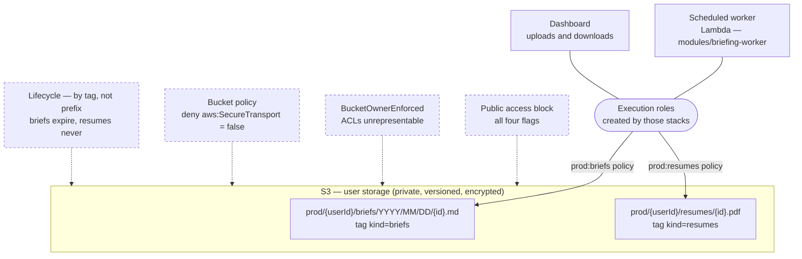

# AWS infrastructure

Terraform for everything this project runs in the cloud. Three stacks today —
**user storage**, the **briefing worker** and the **Vercel dashboard**'s access
to that storage — in one root sharing one state file, plus `bootstrap/`, which
is applied by hand and creates the things that cannot create themselves.

The worker has its own runbook: `DEPLOYING.md`, which also covers the Vercel
OIDC setup.

```
infra/aws/
  versions.tf providers.tf backend.tf variables.tf   the root's own plumbing
  terraform.tfvars                                   committed; the values this deployment uses
  alerting.tf boundary.tf                            shared by every stack
  user-storage.{tf,variables.tf,outputs.tf}          one triple per stack
  briefing-worker.{tf,variables.tf,outputs.tf}
  vercel-dashboard.{tf,variables.tf,outputs.tf}      root-level resources, no module
  tests/                                             terraform test, no credentials needed
  modules/user-storage/                              the bucket, its guards, its IAM
  modules/briefing-worker/                           the lambda, schedule, secret, alarms
  bootstrap/                                         state bucket, GitHub + Vercel OIDC, deploy role, boundary
```

## The rule this layout encodes

**One file triple per stack, and adding a stack touches nothing that exists.**

A new stack is: `<stack>.tf` with the `module` block, `<stack>.variables.tf` with
a single `object({…})` variable, `<stack>.outputs.tf`, and one line in
`terraform.tfvars`. It gets alerting and the permissions boundary for free,
because both are the root's rather than each stack's.

There is no `main.tf`. Terraform reads every `.tf` in the directory as one
configuration, so a file per stack composes exactly as blocks in a shared file
would — without two stacks ever editing the same lines.

Two conventions keep the root from re-becoming a pass-through:

- **One variable per stack, not one per module input.** The root's whole
  interface is six names: `region`, `alert_email`, `schedule_enabled`,
  `user_storage`, `briefing_worker`, `vercel_dashboard`. Stack number four makes
  it seven.
- **A stack whose configuration is not knowable from this repository defaults to
  null and creates nothing.** `vercel_dashboard` is the case: its trust policy
  needs a Vercel team slug and a claim format that has to be read off a real
  token. CI applies this root on every push to `main` touching `infra/**`, so a
  placeholder in `terraform.tfvars` would not sit waiting to be corrected — it
  would be applied. Gating on null means the unconfigured state is a no-op
  rather than a wrong deployment, and `tests/vercel_dashboard.tftest.hcl` asserts
  that it stays one.
- **A field appears in a stack's object only if a deployment varies it,** and
  field documentation is never copied from the module — `modules/<stack>/
variables.tf` is the single source. Duplicated descriptions are how the two
  came to disagree the last time.

One consequence worth knowing before editing: **passing `null` to a module input
does not fall back to that module's default.** It arrives as null. So a default
is written in exactly one place — either the root's object field or the module's
variable, never both — and an input the root has no opinion about is simply not
passed.

## What it provisions



| Resource                       | Why                                                                                      |
| ------------------------------ | ---------------------------------------------------------------------------------------- |
| Bucket                         | one bucket, environments separated by the leading key segment                            |
| Public access block            | all four flags, pinned at the bucket rather than trusting the account                    |
| Ownership controls             | `BucketOwnerEnforced` — a `public-read` object is not merely blocked but unrepresentable |
| Versioning                     | an overwrite supersedes and a delete leaves a marker; both are undoable                  |
| Default encryption             | SSE-S3, or a customer-managed KMS key when `kms_key_arn` is set                          |
| Bucket policy                  | denies any request where `aws:SecureTransport` is false                                  |
| Lifecycle **per kind, by tag** | briefs expire after a year; resumes never expire automatically                           |
| IAM per environment            | every kind in that environment — the broad grant                                         |
| IAM per environment **× kind** | one category only — the narrow grant, and the one to prefer                              |

There is no website configuration, no ACL, and no presigned-URL machinery. An
object is read back through the application using the caller's own credentials.

**Encryption defaults to SSE-S3.** It is free, needs no key policy, and
satisfies encryption at rest. Set `kms_key_arn` when a compliance regime demands
a key you control and rotate — worth revisiting now that the bucket holds
uploaded personal documents rather than only generated text. The module then
adds `kms:Decrypt` and `kms:GenerateDataKey` to each access policy and enables
an S3 Bucket Key, which is what keeps per-object KMS calls from dominating the
bill.

## One environment

`environments = ["prod"]`. That is the whole story, and it is a statement of fact
rather than an aspiration: there is one deployment, one state file, one bucket
and one worker.

A `dev` entry in that list is not a dev environment — it is a key prefix nothing
writes to and three IAM policies nothing is attached to. A second environment,
when it exists, is a second state file, not a second list entry.

## Least privilege, per environment and per kind

Splitting by environment means the identity running production cannot name a
`dev/` key. Splitting by kind means "the scheduled worker can write briefs" and
"the scheduled worker can delete a user's CV" are not the same grant — which
matters more now that one of those is a document the user uploaded.

```json
{
  "Sid": "ReadWriteDeleteOneKind",
  "Effect": "Allow",
  "Action": [
    "s3:PutObject", "s3:PutObjectTagging",
    "s3:GetObject", "s3:GetObjectTagging",
    "s3:DeleteObject"
  ],
  "Resource": "arn:aws:s3:::<bucket>/prod/*/briefs/*"
},
{
  "Sid": "ListOneKindOnly",
  "Effect": "Allow",
  "Action": "s3:ListBucket",
  "Resource": "arn:aws:s3:::<bucket>",
  "Condition": { "StringLike": { "s3:prefix": "prod/*/briefs/*" } }
}
```

Not `s3:*`, and no bucket-level verb. `HeadObject` is authorised by
`s3:GetObject`, so head-before-delete needs no extra grant.
**`s3:PutObjectTagging` is not optional** — the store tags every object with its
kind, the write 403s without it, and the lifecycle rules depend on that tag.

`ListBucket` is a bucket-level action, so its prefix cannot live in the resource
ARN — expressing it as a condition is what stops the grant from enumerating
every environment and every user.

### Every role here carries a permissions boundary

`boundary.tf` looks up `control-panel-deploy-boundary`, created by `bootstrap`,
and every role this root creates is capped by it. The reason is in
`bootstrap/boundary.tf`: the CI deploy role needs `iam:CreateRole`,
`iam:AttachRolePolicy` and `iam:PassRole` to build these stacks at all, and those
three compose into administrator unless something caps the result.

Practical consequence — **a new stack that creates a role must pass the boundary
to it**, exactly as `briefing-worker.tf` does. Forgetting is not a silent
weakening: the deploy role may only create roles that carry the boundary, so the
first CI apply fails with an access-denied naming the role.

If a new stack's roles are not named `briefing-worker-*` or `control-panel-*`,
add the pattern to `managed_role_arn_patterns` in `bootstrap/variables.tf`. That
too fails loudly rather than quietly.

## Retention: why it is tag-based

Lifecycle rules filter on an object **tag**, not a key prefix, because the key
layout puts `userId` between the two fixed segments and S3 lifecycle filters take
no wildcards. `packages/user-storage/README.md` §What this layout costs has the
full reasoning, including why the layout is worth that price.

The consequence that lands here: a kind added to
`packages/user-storage/src/kinds.ts` without a matching entry in `object_kinds`
gets **no retention policy at all**. It will not error; it will just accumulate.
`tests/user_storage.tftest.hcl` asserts the correspondence, so that failure is
caught on a pull request.

## Applying it

`bootstrap` must have been applied once first — it creates the state bucket this
root's backend points at, and the permissions boundary `boundary.tf` looks up.
See `bootstrap/README.md`.

```bash
pnpm turbo zip --filter=@workspace/briefing-worker   # build first — see below
terraform -chdir=infra/aws init -backend-config="bucket=<state-bucket>"
terraform -chdir=infra/aws plan
terraform -chdir=infra/aws apply
```

**Build before planning, not before applying.** `filebase64sha256` reads
`lambda.zip` at _plan_ time, so a plan on an unbuilt tree fails with a
file-not-found that reads like a Terraform bug and is not one.

No `-var` flags: `terraform.tfvars` is committed and auto-loaded, so the values
applied are the values in the diff. It is the one exception to the `*.tfvars`
gitignore rule, and nothing in it is secret.

Credentials come from the default provider chain: an OIDC-federated role in CI,
a profile or SSO session locally. There are no credentials in this tree and no
variable that accepts them — an access key written into a `.tf` file lands in
state and in the diff of every plan.

### Variables

| Variable           | Type   | Default          | Notes                                                     |
| ------------------ | ------ | ---------------- | --------------------------------------------------------- |
| `region`           | string | `ap-southeast-2` | Sydney — nearest region to the only user                  |
| `alert_email`      | string | —                | required; feeds the one shared SNS topic                  |
| `schedule_enabled` | bool   | `true`           | flat on purpose — the one CLI override                    |
| `user_storage`     | object | —                | `bucket_name` required; see `user-storage.variables.tf`   |
| `briefing_worker`  | object | `{}`             | see `briefing-worker.variables.tf`                        |
| `vercel_dashboard` | object | `null`           | null creates nothing; see `vercel-dashboard.variables.tf` |

Fields inside the objects are documented on the modules' own variables, not
restated here.

### Outputs

| Output                          | Feeds                                                   |
| ------------------------------- | ------------------------------------------------------- |
| `user_storage_bucket_name`      | `USER_STORAGE_BUCKET_NAME` on the workload              |
| `user_storage_bucket_region`    | `AWS_REGION` on the workload                            |
| `user_storage_policy_arns`      | per environment, every kind — the broad grant           |
| `user_storage_kind_policy_arns` | keyed `<environment>:<kind>` — the narrow grant, prefer |
| `alerts_topic_arn`              | the one topic every stack's alarms publish to           |
| `worker_*`                      | function name, roles, log group, the two secret ARNs    |
| `vercel_dashboard_role_arn`     | `AWS_ROLE_ARN` on the Vercel project                    |

The workload also needs `USER_STORAGE_ENVIRONMENT`, which is not an output — it
is the workload's own identity, and the bucket has no opinion about which
environment is deploying against it.

## State

Remote, in S3, with native locking. `backend.tf` is a **partial** configuration:
the block exists so Terraform uses remote state at all, but the bucket is
supplied at init time rather than written into the repository, so nothing here
names a bucket that might not exist.

```bash
terraform -chdir=infra/aws init -backend-config="bucket=<state-bucket>"
```

Keep a local `backend.hcl` (gitignored) so repeat inits are one flag:

```hcl
bucket = "control-panel-tfstate-<account-id>"
```

`use_lockfile` is S3-native locking — it needs Terraform ≥ 1.11, which is why
`required_version` says so, and it removes the DynamoDB table the deprecated
`dynamodb_table` argument needed.

`terraform init -backend=false` still works untouched, which is what `fmt`,
`validate` and `test` use in CI and why a missing bucket cannot block a pull
request.

State must not be committed — `.gitignore` covers `*.tfstate`.
`.terraform.lock.hcl` is the exception and **is** committed: it pins the
provider versions everyone resolves.

## Verifying without an account

```bash
terraform -chdir=infra/aws fmt -recursive -check
terraform -chdir=infra/aws init -backend=false
terraform -chdir=infra/aws validate
terraform -chdir=infra/aws test
```

`test` is the one that earns its keep. `validate` catches type errors; the suite
under `tests/` runs a mocked plan and asserts on what it produces — both retry
layers at zero, every object kind carrying a lifecycle rule, the missed-run alarm
gated on the schedule, all four public-access-block flags set. It needs no
credentials, no network and no state, so it runs on a pull request.

Two things about it are worth knowing before extending it:

- **`run` blocks target modules directly** (`module { source = "./modules/…" }`),
  because `expect_failures` can only name checkable objects in the module under
  test and these validations live on the modules' own variables.
- **Policy _contents_ are not asserted.** `aws_iam_policy_document` is a data
  source, so under a mock provider its `json` is a stub — the mock returns an
  empty-but-valid policy purely to satisfy the provider's plan-time JSON check.
  Asserting on rendered policy JSON needs `override_data` per address and is a
  worthwhile separate pass.

Beyond that, `terraform plan` calls STS `GetCallerIdentity` while configuring the
provider and fails before it reaches any resource, so a real plan and the first
`apply` wait on an AWS account.

## Handoff to the workload stacks

`modules/user-storage` creates **no IAM role**. An execution role belongs to the
workload's own stack, and creating it here would make two stacks contend over one
resource. Three steps connect them:

1. Attach `user_storage_kind_policy_arns["<environment>:<kind>"]` to the
   execution role — the narrow grant. Use `user_storage_policy_arns` only when a
   workload genuinely touches every kind. `briefing-worker.tf` is the worked
   example.
2. Set `USER_STORAGE_BUCKET_NAME`, `USER_STORAGE_ENVIRONMENT` and `AWS_REGION`
   on the function.
3. Call `createS3UserObjectStore()` once at the composition root, wrap it in
   `createBriefStore` / `createResumeStore`, and pass those down. See
   `packages/user-storage/README.md`.
